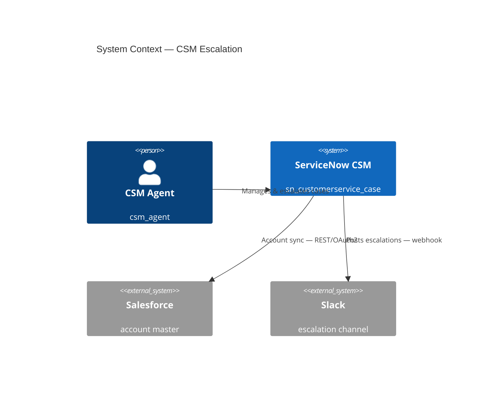
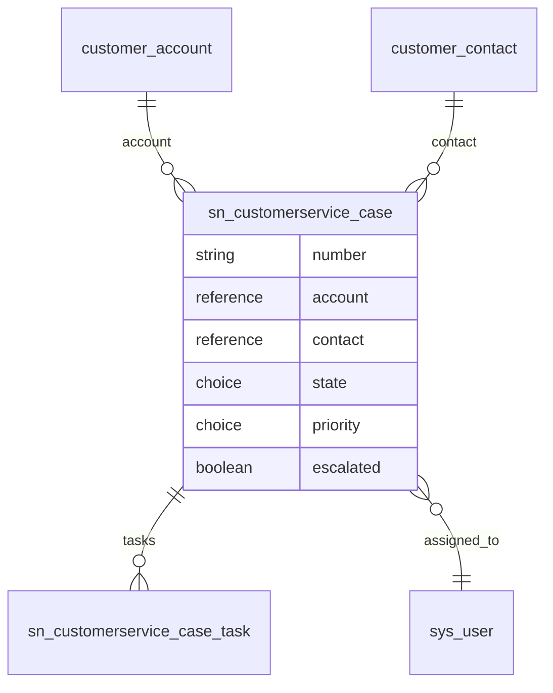
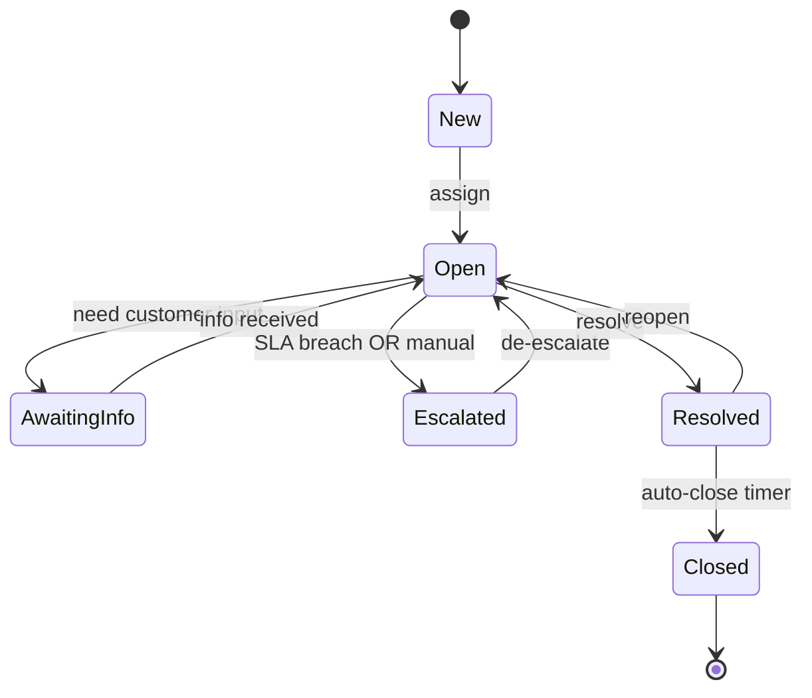
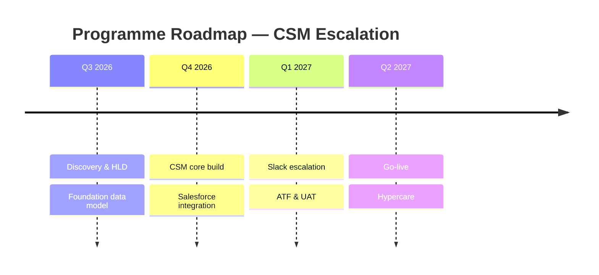
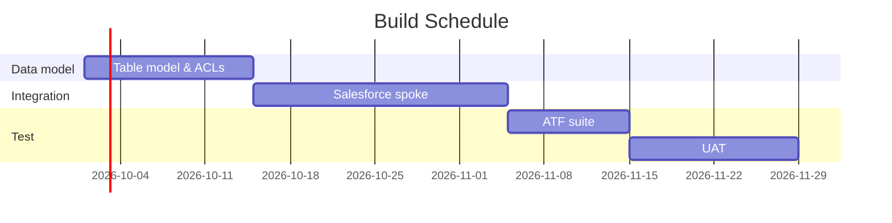
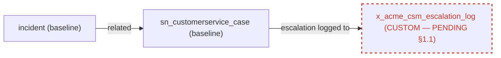

# Diagramming Specialist — EXAMPLES

Gold-standard reference. Every example applies the discipline from `SKILL.md`: a legend, exact spec identifiers, one message per figure, fidelity notes, and §1.1 flags. Mermaid is the default; all blocks are written to parse.

---

## Example 1 — Skill mode: one sequence diagram (integration round-trip)

**Source spec:** Integration Specialist spec "P1/P2 incident → Azure DevOps work item on resolve". **Format:** Mermaid.

### Legend
Actors = participants; ServiceNow components prefixed `SN`; external system on the right; `Note` blocks carry non-happy-path behaviour.

### Figure 1 — Resolve-to-ADO outbound call (happy path + failure handling)
```mermaid
sequenceDiagram
    autonumber
    actor A as Agent (itil)
    participant SN as ServiceNow (incident)
    participant FL as Flow Designer
    participant SP as ADO Spoke (IntegrationHub)
    participant ADO as Azure DevOps (REST / OAuth2)
    A->>SN: Resolve incident (state → 6 Resolved)
    SN->>FL: Trigger — incident.state=6 AND priority IN (1,2)
    FL->>SP: Create Work Item action
    SP->>ADO: POST /_apis/wit/workitems (OAuth2)
    ADO-->>SP: 201 Created (id)
    SP-->>FL: work_item_id
    FL->>SN: Set incident.u_ado_ref = work_item_id
    Note over SP,ADO: Retry 3x exponential backoff;<br/>exhausted → DLQ record + work note on incident
```

### Fidelity notes
- `incident`, `state=6 (Resolved)`, `priority IN (1,2)` — taken verbatim from the spec's trigger condition.
- `u_ado_ref` is the custom field named in the spec (custom field on a baseline table = configuration, not a §1.1 object).
- ADO endpoint path is illustrative; the spec owns the exact route.

### §1.1 flags
None — no custom table, scope, or state introduced.

### Export notes
Mermaid renders in the PR. For the client pack, export to SVG (`mmdc -i fig.mmd -o fig.svg`) or rebuild in draw.io.

---

## Example 2 — Sub-agent mode: a 3-figure diagram pack for an HLD

**Source spec:** Technical Designer spec + CSM gateway Constraint Envelope, "Customer escalation capability". **Format:** Mermaid. One legend governs all figures.

### Legend
Platform systems = `System`; external = `System_Ext`; baseline tables solid; references shown with cardinality; lifecycle states are nodes.

### Figure 1 — System context (C4 L1) — *who and what talks to the platform*


### Figure 2 — Data model (ERD) — *the records and their relationships*


### Figure 3 — Case lifecycle (state) — *the one message: how a case moves*


### Fidelity notes
- All table names (`sn_customerservice_case`, `customer_account`, `customer_contact`, `sn_customerservice_case_task`) and the `escalated` field come from the Envelope's Data Model Alignment — all baseline.
- `Escalated` is modelled as a *state transition driver*, not a new `state` choice value, matching the spec (escalation is a flag + flow, not a custom state).

### §1.1 flags
None — every object is baseline-confirmed in the Constraint Envelope.

### Export notes
Three figures, one legend. For the review board deck, export each to SVG at 2x; keep the Mermaid source in the HLD appendix so the figures stay diff-able.

---

## Example 3 — Project visuals (the "and so on": roadmap, schedule, RACI)

**Source spec:** programme plan in the HLD. **Format:** Mermaid + a RACI table.

### Figure 1 — Roadmap (timeline)


### Figure 2 — Build schedule (Gantt with dependencies)


### Figure 3 — RACI (rendered as a table, not a graph)
| Activity | Architect | Developer | CSM Lead | Ops |
|---|---|---|---|---|
| Table model & ACLs | A/R | C | C | I |
| Salesforce integration | A | R | C | I |
| UAT sign-off | C | I | A/R | C |
| Go-live & hypercare | A | R | C | R |

*R = Responsible, A = Accountable, C = Consulted, I = Informed.*

### Fidelity notes
Phases, durations, and ownership are lifted from the programme plan; no dates invented — where the plan was silent (e.g. hypercare length) it's marked open below.

### Open questions
- Hypercare duration not stated in the plan — assumed within Q2 2027; confirm.

---

## Example 4 — §1.1 flag: the spec contains an unapproved custom table

**Source spec:** a draft design that introduces `x_acme_csm_escalation_log` with **no approval trail**. The Diagramming Specialist still draws it — but renders it PENDING, never as accepted.

### Legend
Baseline = solid; **custom-pending = dashed red border**.

### Figure 1 — Escalation logging (custom object flagged)


### §1.1 flags
- **`x_acme_csm_escalation_log`** — custom table, **no approval in the source spec**. Rendered dashed/PENDING. This is **not mine to bless**: the orchestrator must run the §1.1 ruling (baseline option evaluated — could `sys_journal_field`/work notes or the audit history cover this? — custom proposed at smallest scope, consequences, alternatives) before any builder treats it as accepted. Until then the diagram shows it pending and this flag stands.

### Fidelity notes
The table is drawn because the *spec* contains it; the dashed style and PENDING note encode that it lacks approval. Removing it would misrepresent the spec; drawing it solid would launder the violation — so it is shown, but flagged.

---

## Example 5 — Export to SVG and embed into an HLD

Takes the Figure-2 ERD from Example 2 and ships it as a rendered SVG embedded in the HLD — the standard "save as SVG + add into the document" workflow.

**1. Save the source** — `clients/acme/csm-escalation-hld/diagrams/fig-02-data-model.mmd` (the `erDiagram` block, verbatim).

**2. Render locally** (no external service; Windows reuses Edge/Chrome — no Chromium download):
```
pwsh scripts/render-diagrams.ps1 -Path clients/acme/csm-escalation-hld/diagrams
# or:  bash scripts/render-diagrams.sh clients/acme/csm-escalation-hld/diagrams
```
→ writes `fig-02-data-model.svg` beside the source.

**3. Embed into the HLD section** — for the Word/PDF deliverable, place the rendered image with its numbered caption:
```

```
For PR-review markdown, keep the inline ` ```mermaid ` fenced block as well, so the figure stays diff-able.

**4. Diagram Sources appendix** (keeps every figure regenerable):

| Figure | Source (`.mmd`) | Rendered (`.svg`) |
|---|---|---|
| Figure 2 — Data model (ERD) | `diagrams/fig-02-data-model.mmd` | `diagrams/fig-02-data-model.svg` |

The `.mmd` is the source of truth; the `.svg` is the artefact. After any edit, re-run step 2 to regenerate.

---

## Example 6 — Tier-2 hand-crafted SVG house style (copy-paste skeleton)

The designed look (gradients, soft shadow, palette, legend) for hero/client-facing figures. Author SVG directly to this skeleton — `<defs>` carries the house gradients, shadow, and arrowheads; cards are rounded rects with two text lines; baseline solid, custom dashed/PENDING.

```svg
<svg xmlns="http://www.w3.org/2000/svg" viewBox="0 0 600 180" font-family="'Segoe UI', system-ui, Arial, sans-serif">
  <defs>
    <linearGradient id="gPlat" x1="0" y1="0" x2="0" y2="1"><stop offset="0" stop-color="#eafaf1"/><stop offset="1" stop-color="#d6f0e1"/></linearGradient>
    <linearGradient id="gPend" x1="0" y1="0" x2="0" y2="1"><stop offset="0" stop-color="#fff5f5"/><stop offset="1" stop-color="#fde4e4"/></linearGradient>
    <filter id="sh" x="-20%" y="-20%" width="140%" height="160%"><feDropShadow dx="0" dy="2" stdDeviation="3.2" flood-color="#1f2937" flood-opacity="0.16"/></filter>
    <marker id="arr" viewBox="0 0 10 10" refX="9" refY="5" markerWidth="7" markerHeight="7" orient="auto-start-reverse"><path d="M0,0 L10,5 L0,10 z" fill="#94a3b8"/></marker>
  </defs>
  <g filter="url(#sh)"><rect x="30" y="54" width="170" height="72" rx="14" fill="url(#gPlat)" stroke="#18a558" stroke-width="1.6"/></g>
  <text x="115" y="86" text-anchor="middle" font-size="15" font-weight="600" fill="#0a5c38">ServiceNow</text>
  <text x="115" y="106" text-anchor="middle" font-size="11.5" fill="#3b7a5a">incident</text>
  <line x1="200" y1="90" x2="288" y2="90" stroke="#94a3b8" stroke-width="2.2" marker-end="url(#arr)"/>
  <g filter="url(#sh)"><rect x="290" y="54" width="210" height="72" rx="14" fill="url(#gPend)" stroke="#dc2626" stroke-width="1.8" stroke-dasharray="7 5"/></g>
  <text x="395" y="86" text-anchor="middle" font-size="14" font-weight="600" fill="#b91c1c">x_acme_custom</text>
  <text x="395" y="106" text-anchor="middle" font-size="11" fill="#dc2626">CUSTOM &#183; PENDING &#167;1.1</text>
</svg>
```

Full worked reference: `skills/diagramming-specialist/templates/house-style-reference.svg` (the committed hero). **Hand-craft every delivered figure to this standard** — node labels exact-to-spec, the shared palette, one shared legend across the figure set; never ship a recolored Mermaid as the figure.

---

*End of Diagramming Specialist EXAMPLES.md v1.0.*
