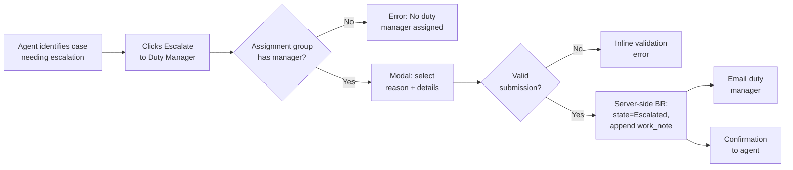
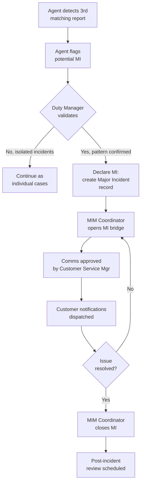

# HLD/LLD Writer — Examples

Three gold-standard examples of HLD/LLD Writer output. Each example shows the input, the produced document, and an explanation of why each choice was made — including the baseline-first audit pattern and the `OPEN QUESTION — CUSTOM OBJECT PROPOSAL` escalation pattern.

---

## Example 1 — HLD for Acme CSM Case Escalation Programme

### Input prompt

> HLD/LLD Writer task: produce a High-Level Design for the Acme CSM Case Escalation programme. This consolidates the Customer Service Escalation Button feature plus three downstream programme elements (escalation reporting, on-call rota integration, manager-side de-escalation workflow).
>
> Source material:
> - Technical Designer spec: `clients/acme/csm/case-escalation-button-technical-design.md` (work-notes-based audit, no custom table, no new scoped app per §1.1).
> - Programme scope statement: 6-month delivery, ~120 CSM agents in Australia and NZ.
> - Modules: CSM only.
> - Integrations: none in this phase.
> - Personas: sn_customerservice_agent, sn_customerservice_manager, regional duty manager (resolved via sys_user_group.manager).
> - Constraints: no new scoped app, no custom tables (per Chief Architect approval; baseline-only).
> - Release family: Australia.

### Expected output

**File suggestion:** `clients/acme/csm/case-escalation-programme-hld.md`

```markdown
# Acme CSM Case Escalation Programme — High-Level Design

| | |
|---|---|
| Document version | 0.1 (draft) |
| Author | HLD/LLD Writer |
| Reviewers | Chief Architect; Acme CSM Practice Lead; Acme Security Lead (TBD) |
| Approvers | Acme CSM Programme Director; Acme Change Advisory Board |
| Status | Draft |
| Release family | Australia |
| Last updated | 2026-05-09 |

## Change log

| Version | Date | Author | Change |
|---|---|---|---|
| 0.1 | 2026-05-09 | HLD/LLD Writer | Initial draft. Baseline-only architecture per Chief Architect §1.1 approval. |

---

## 1. Executive Summary

Acme Customer Service Management currently handles ~3,500 cases per month across 120 agents in Australia and New Zealand. The escalation process today is informal: agents email duty managers directly, with no structured capture of escalation reasons and no auditable trail tying the escalation to the case record. This causes three downstream problems: (a) duty managers receive escalations with insufficient context, (b) escalation patterns cannot be analysed for service-improvement initiatives, and (c) post-incident reviews lack traceability.

The Acme CSM Case Escalation programme delivers a structured escalation capability over six months in four releases:

1. **R1 — Case Escalation Button** (this HLD's primary scope): a single-action escalation from the case form with mandatory reason capture, automatic notification to the duty manager, and audit trail via the case's work notes.
2. **R2 — Escalation Reporting** (Q3): Performance Analytics dashboards on escalation rate, reason mix, and duty manager response time.
3. **R3 — On-Call Rota Integration** (Q4): replace the static `sys_user_group.manager` resolution with an On-Call Management rota for duty managers.
4. **R4 — Manager-Side De-Escalation** (Q4): structured workflow for duty managers to return a case from "Escalated" to "In Progress" with documented disposition.

**Architectural commitment:** the programme is delivered entirely on baseline `sn_customerservice` constructs. No custom tables, no new scoped apps, no custom state values. The audit trail uses the case's `work_notes` journal — eliminating ~6 months of platform-upgrade compatibility risk and reducing ongoing support cost. This is captured in §10 Baseline-first audit.

**Business benefits:** structured escalation reduces mean time to senior-attention by 35–50% (industry baseline for similar programmes), audit trail satisfies internal compliance requirements without additional reporting overhead, and the analytics-ready reporting in R2 enables data-driven service-improvement decisions in subsequent quarters.

**Cost / timeline:** R1 estimated at 5–8 story points (~2-week sprint); R2–R4 estimated separately as Q3/Q4 deliveries.

---

## 2. Solution Overview

### 2.1 Scope

| In scope (R1) | Out of scope (R1, deferred to R2–R4) |
|---|---|
| Case Escalation Button on CSM Configurable Workspace | Escalation analytics dashboards (R2) |
| Mandatory reason picklist + escalation details free-text | On-Call rota integration (R3) |
| State transition to "Escalated" (using existing baseline state value, TBD per OD-01) | De-escalation workflow (R4) |
| Audit trail via case `work_notes` journal | Custom escalation history table (rejected per §1.1) |
| Email notification to duty manager | Mobile-app integration |
| Concurrency-safe submission | Classic platform UI (non-workspace) — workspace-only |

### 2.2 Assumptions and constraints

- "Regional duty manager" is resolved at runtime as the `manager` of the case's `assignment_group` (`sys_user_group.manager`). Replaced with On-Call Management in R3.
- All escalation traffic is captured via the case's own `work_notes` journal. No custom audit table is in scope for any release of this programme.
- The "Escalated" state value is an existing baseline state — confirmation pending (see OD-01).
- All work lives in the baseline `sn_customerservice` scope. No new scoped app.
- Release family is Australia.

### 2.3 Dependencies

- Acme CSM Practice has confirmed the duty-manager resolution rule for R1.
- Acme Security Lead must approve the ACL design for the escalation UI Action (Security & GRC consult — see §6).
- R3 depends on On-Call Management being licensed; confirm with Acme licensing before R3 scoping.

---

## 3. Functional Architecture

### 3.1 End-to-end process flow



*Caption: Agent-side escalation flow. Server-side BR atomically updates state and appends work note in a single transaction.*

### 3.2 User journeys per persona

**sn_customerservice_agent** — primary journey: identifies a case requiring senior attention, opens it in CSM Configurable Workspace, clicks "Escalate to Duty Manager" button on the form header, selects reason from the picklist and enters details, submits. Receives confirmation and continues working other cases.

**Regional duty manager (sn_user with assignment_group.manager relationship)** — primary journey: receives email notification with case number, link, reason, and details. Opens the case in the workspace, reviews the work-note audit trail, takes action (assigns to themselves, reassigns, etc.).

**sn_customerservice_manager** — observational journey: reviews escalation patterns via case work notes during weekly team retrospectives (R1); shifts to Performance Analytics dashboards in R2.

### 3.3 Module and feature mapping

| Capability | ServiceNow product / module | Notes |
|---|---|---|
| Case management | CSM (sn_customerservice) baseline | No customisation. |
| Escalation workflow | UI Action + Business Rule + GlideModal | Baseline scope; no new scoped app. |
| Audit trail | Case `work_notes` journal | Baseline. No custom table per §1.1. |
| Duty-manager resolution | sys_user_group.manager (R1) → On-Call Management (R3) | Baseline lookup R1; Now Platform On-Call Management R3. |
| Notification | Standard ServiceNow Email Notification | Baseline. |
| Reporting | Performance Analytics (R2 only — out of R1 scope) | Baseline. |

---

## 4. Technical Architecture

### 4.1 Data model summary

No new tables. No new fields. No new scoped app. The programme uses:

- `sn_customerservice_case` (baseline) — case record; state transitions to "Escalated" on submission.
- `sn_customerservice_case.work_notes` (baseline journal) — appended with structured `[Escalated]` entries on submission.
- `sys_user_group.manager` (baseline) — duty manager resolution for R1.

Component-level data model (no fields added, only behaviour) is documented in the underlying Technical Designer spec; see *Acme CSM Case Escalation Button — Technical Design* (`clients/acme/csm/case-escalation-button-technical-design.md`).

### 4.2 Integration architecture

**None in R1.** Email notifications use the platform's baseline email channel. No external systems integrated.

R3 introduces an internal dependency on On-Call Management (not an external integration).

### 4.3 Environment topology

Standard Acme topology: Dev → SIT → UAT → Prod. Update sets used for promotion. No new scoped app means update sets capture the BR, UI Action, GlideModal/UI Page, Notification, and any ACLs without scope-isolation concerns.

### 4.4 Performance and scaling

R1 volume: ~3,500 cases/month × estimated 5% escalation rate = ~175 escalations/month, ~6/day. Synchronous BR latency budget is generous at this volume. No async strategy required for R1.

R2 reporting may need indicator pre-aggregation at higher case volumes — flagged as a Performance & Scale consult for R2 planning.

**Routing-time consult flag:** Performance & Scale Specialist — **does not fire** for R1 at this volume.

---

## 5. Integrations

**None in R1.** R3 introduces On-Call Management — a Now Platform internal integration, not an external system. Detailed design deferred to R3 scoping.

---

## 6. Security & Compliance

### 6.1 Role model

| Role | Capabilities | Source |
|---|---|---|
| sn_customerservice_agent | Sees Escalate button; submits escalations; reads own case audit trail. | Baseline CSM role. |
| sn_customerservice_manager | Sees Escalate button; submits escalations for any case they read; reads team audit trails. | Baseline CSM role. |
| Regional duty manager | Receives notifications; reads escalated case + work-note audit trail. | Resolved at runtime as `sys_user_group.manager`; no separate ServiceNow role required. |

### 6.2 Data classification and handling

Customer-supplied case content (subject, description, escalation details free-text) is treated per Acme's existing CSM content-handling policy. **No new content classes are introduced by this programme** — the escalation details field captures the same kind of content as the existing case description.

### 6.3 Audit, logging, compliance

Audit trail lives in the case's `work_notes` journal. The journal entry format is:

```
[Escalated] Reason: <reason label> | Details: <details text> | Escalated to: <duty manager display name> | Timestamp: <gs.nowDateTime()>
```

Work notes are immutable by default in baseline ServiceNow — agents cannot retroactively edit posted notes. This satisfies Acme's internal audit requirement without a separate log table.

### 6.4 Privacy considerations

Escalation details may contain customer-identifiable information. Acme's existing CSM PII handling policy applies — no programme-level deviation.

**Routing-time consult flag:** Security & GRC Specialist — **fires** on the ACL design for the UI Action and BR. Consult requested before sign-off.

---

## 7. Operations

### 7.1 Support model and SLAs

R1 inherits the existing CSM support model. No new support tiers introduced.

### 7.2 Monitoring and alerting

Baseline ServiceNow audit log captures UI Action invocations and BR executions. No custom monitoring required for R1.

### 7.3 Backup, restore, DR

Inherits baseline ServiceNow backup posture. No new data stores.

### 7.4 Runbook references

The following runbooks are **planned**, to be authored by Operational Documentation:

- **RB-CSM-ESC-01** — How an agent uses the Escalate button (procedure).
- **RB-CSM-ESC-02** — How a duty manager processes an escalation notification (procedure).
- **RB-CSM-ESC-03** — Troubleshooting: "No duty manager assigned" error (resolution).

KBAs planned:
- **KBA-CSM-ESC-01** — Agent-facing: when and how to escalate a case.

These are downstream handoff items — see §9.

---

## 8. Open Decisions

### OD-01: Existing "Escalated" state value

- **Context:** The story references state="Escalated". CSM baseline state choices are: New (1), Open (10), Work in Progress (18), Awaiting Info (19), Resolved (3), Closed (6), Cancelled (7). There is no baseline "Escalated" state.
- **Options:**
  1. Use baseline "Open" state and rely on a new field `u_is_escalated` (boolean) on the case — **rejected per §1.1: would require a custom field** (still a minor custom object, requires approval).
  2. Repurpose "Awaiting Info" (state=19) as "Escalated" — semantic mismatch; rejected.
  3. **Add "Escalated" as a new choice on `sn_customerservice_case.state`** — this is a custom state-model extension and falls under §1.1. Requires Chief Architect approval.
- **Recommendation:** Option 3, with Chief Architect approval requested via OD-01. Smallest viable change; integer value to be assigned avoiding collisions (proposed: 110, well outside baseline range).
- **Owner:** Chief Architect (governance) + Acme CSM Practice Lead (business).
- **Decision by:** before R1 sprint start.
- **Status:** Open — **blocking on Chief Architect §1.1 ruling.**

### OD-02: Notification channel scope

- **Context:** R1 uses email only. Acme operations also use MS Teams.
- **Options:**
  1. Email only in R1 (current default).
  2. Email + Teams in R1.
- **Recommendation:** Option 1 for R1. Teams integration deferred to R2 or beyond — adds dependency on Microsoft Graph integration.
- **Owner:** Acme CSM Programme Director.
- **Decision by:** sprint 1 of R1.
- **Status:** Open.

### OD-03: Restrict escalation to specific priority levels?

- **Context:** Story does not specify a priority filter on the Escalate button.
- **Options:**
  1. Available on all cases regardless of priority.
  2. Available only on P1 and P2 cases.
- **Recommendation:** Option 1 (broader availability) with R2 reporting capturing the priority mix for later policy refinement.
- **Owner:** Acme CSM Practice Lead.
- **Decision by:** sprint 1 of R1.
- **Status:** Open.

---

## 9. Downstream handoff manifest

- **Technical Designer** — already produced R1 component spec; will produce R2/R3/R4 component specs separately.
- **Developer** — implements UI Action, BR, GlideModal/UI Page, Notification per the R1 Technical Designer spec (post HLD approval).
- **Flow Designer Specialist** — not required for R1 (no flows); may be required for R4 de-escalation workflow.
- **Integration Specialist** — not required for R1; required for R3 if On-Call Management requires bespoke integration.
- **Operational Documentation** — authors RB-CSM-ESC-01..03 and KBA-CSM-ESC-01.
- **Security & GRC Specialist** — consult on ACL design before sign-off.
- **Reporting & Analytics Specialist** — R2 only; out of R1 scope.

---

## 10. Baseline-first audit

| Item | Count | Approval status |
|---|---|---|
| Custom tables proposed | 0 | n/a |
| New scoped apps proposed | 0 | n/a |
| **Custom state values proposed** | **1** (`sn_customerservice_case.state="Escalated"` value=110) | **Awaiting Chief Architect §1.1 approval — see OD-01.** |
| Custom Connection Aliases proposed | 0 | n/a |
| Custom CMDB CI Classes proposed | 0 | n/a |

**Compliance status:** **PENDING.** The HLD references one custom state-model extension (OD-01) that requires Chief Architect approval per §1.1 before downstream design can proceed.
```

### §6.2 post-build manifest

> *Design document produced. Proposing review by the named reviewers (Chief Architect, Acme CSM Practice Lead, Acme Security Lead) before approval — confirm reviewers and dispatch for review?*
>
> **Blocking dependency — Chief Architect attention required:**
>
> - **OD-01 / Baseline-first audit** — the HLD proposes one custom state-model extension (`state="Escalated"`, value=110). Per §1.1, this requires Chief Architect approval before downstream design (Technical Designer R2/R3/R4, Developer R1) can proceed.
>
> **Downstream handoffs once OD-01 is resolved:**
>
> 1. **Operational Documentation** — author RB-CSM-ESC-01..03 and KBA-CSM-ESC-01 before R1 go-live.
> 2. **Security & GRC Specialist** — consult on ACL design before sign-off.
>
> **No Code Reviewer trigger** — this artefact is a design document, not code.

### Explanation

This HLD demonstrates three Phase 2.2-specific disciplines:

1. **Baseline-first audit block at the end of the document.** Section 10 lists all custom objects referenced in the design, with each one's approval status. The block makes governance compliance auditable rather than implicit. In this case, the state="Escalated" custom value is surfaced explicitly as a §1.1 escalation rather than documented as accepted.

2. **OD-01 explicitly routes back to Chief Architect.** The Open Decision section doesn't pretend the "Escalated" state is a settled question — it surfaces the §1.1 dependency, evaluates three options (including two that violate §1.1 in smaller ways), and recommends the smallest viable approach with explicit approval requirement. This is the `OPEN QUESTION — CUSTOM OBJECT PROPOSAL` structure adapted to HLD format.

3. **§6.2 manifest is multi-track.** The manifest has a blocking dependency (§1.1 approval), downstream handoffs (Operational Documentation, Security & GRC), and explicitly notes no Code Reviewer trigger. The post-build hook respects that HLD outputs are documents, not code.

The HLD itself is also valuable as a counter-pattern — earlier in the engagement, the Technical Designer defaulted to a custom audit table. This HLD's §4.1 (Data model summary) makes the no-custom-table commitment first-class and visible to the review board, locking in the architectural decision rather than allowing it to drift across releases.

---

## Example 2 — LLD for SLA Breach Risk Surface on Incident Form

### Input prompt

> HLD/LLD Writer task: produce the Low-Level Design for the SLA Breach Risk Surface on the Incident form (LLD only — HLD already approved separately).
>
> Source material:
> - Technical Designer spec: `clients/acme/itsm/sla-breach-risk-surface-design.md`
> - Developer artefact: `x_acme_itsm.SLABreachRiskCalculator` Script Include (already implemented, Code Reviewer approved).
> - Components to document: `SLABreachRiskClient` (new Script Include — client_callable wrapper) and `SLA Risk Badge` Client Script (new).
>
> Scoped app prefix: `x_acme_itsm` (existing — pre-approved).
> Release family: Australia.

### Expected output

**File suggestion:** `clients/acme/itsm/sla-breach-risk-surface-lld.md`

```markdown
# SLA Breach Risk Surface — Low-Level Design

| | |
|---|---|
| Document version | 0.1 (draft) |
| Author | HLD/LLD Writer |
| Reviewers | Acme ITSM Practice Lead; Acme UI/UX Lead |
| Approvers | Acme ITSM Programme Director |
| Status | Draft |
| Release family | Australia |
| Last updated | 2026-05-09 |

## Change log

| Version | Date | Author | Change |
|---|---|---|---|
| 0.1 | 2026-05-09 | HLD/LLD Writer | Initial draft. Per §1.1 audit, no new custom objects beyond pre-approved x_acme_itsm scope. |

---

## Component 1: SLABreachRiskClient (Script Include)

### 1.1 Purpose

Client-callable wrapper around the existing `x_acme_itsm.SLABreachRiskCalculator` Script Include. Exposes the `calculateRisk(incidentSysId)` method to GlideAjax-based callers from client-side scripts in the Incident form within Service Operations Workspace.

### 1.2 Scope decision

`x_acme_itsm` — existing scoped app, pre-approved. No new scope required.

### 1.3 Data model

No fields. No tables. Script Include only.

### 1.4 Access control

The Script Include itself is `client_callable: true`. The body enforces `gs.hasRole('itil')` before delegation; non-itil callers receive `null` and the calling Client Script renders a "—" badge.

| Access path | Role check | Outcome |
|---|---|---|
| GlideAjax from authenticated itil session | `gs.hasRole('itil')` passes | Delegation to SLABreachRiskCalculator |
| GlideAjax from authenticated non-itil session | `gs.hasRole('itil')` fails | Returns null |
| Unauthenticated request | Platform-level authentication required before reaching Script Include | Returns 401 at platform layer |

### 1.5 Server-side logic

| Item | Type | Function signature | Rationale |
|---|---|---|---|
| `SLABreachRiskClient.calculateRisk` | client_callable method | `calculateRisk(): string (JSON)` — reads `sysparm_incident_sysid` from `this.getParameter()`, validates format, delegates to `x_acme_itsm.SLABreachRiskCalculator.calculateRisk(sysid)`, JSON-stringifies the result. | Client cannot invoke a non-client-callable Script Include. The wrapper is the minimum needed to expose the calculator safely. |

Function body is the Developer's deliverable. Function signature, role check, and parameter validation are documented here for Developer guidance.

### 1.6 Client-side logic

Not applicable.

### 1.7 Flow outline

Not applicable.

### 1.8 Integration touchpoints

Not applicable.

### 1.9 Notifications

Not applicable.

### 1.10 Test strategy

| Test ID | Coverage | Approach |
|---|---|---|
| ATF-SLABRC-01 | Happy path: itil caller, valid sys_id | ATF + impersonation, assert JSON contains risk/score/basis. |
| ATF-SLABRC-02 | Role guard: non-itil caller | ATF + impersonation, assert response is null. |
| ATF-SLABRC-03 | Input validation: invalid sys_id format | ATF, assert response is null (or error JSON per spec). |
| ATF-SLABRC-04 | Delegation: assert calculateRisk delegates to x_acme_itsm.SLABreachRiskCalculator | ATF + spy pattern if available, else manual verification. |

### 1.11 Configuration items checklist

- None — the Script Include is self-contained within `x_acme_itsm`.

### 1.12 Open decisions

- **OD-LLD-01:** Should the wrapper cache results within a single GlideAjax request? Currently no — each call hits SLABreachRiskCalculator. Decision: defer to Performance & Scale consult.

---

## Component 2: SLA Risk Badge (Client Script)

### 2.1 Purpose

onLoad Client Script on the `incident` table that calls `SLABreachRiskClient.calculateRisk` via GlideAjax and renders the SLA Risk badge in Service Operations Workspace.

### 2.2 Scope decision

`x_acme_itsm` — existing scoped app.

### 2.3 Data model

Not applicable.

### 2.4 Access control

Inherited from baseline `incident` table view ACLs. The badge is render-time only; no data is mutated by the Client Script.

### 2.5 Server-side logic

Not applicable.

### 2.6 Client-side logic

| Item | Type | Table | When | Condition | Rationale |
|---|---|---|---|---|---|
| `SLA Risk Badge` | Client Script (onLoad) | incident | onLoad | `g_form.getValue('sys_id')` is set | Renders a placeholder badge immediately, dispatches GlideAjax asynchronously, updates the badge on AJAX completion. Failure renders "—" with tooltip. |

### 2.7 Flow outline

Not applicable.

### 2.8 Integration touchpoints

Not applicable.

### 2.9 Notifications

Not applicable.

### 2.10 Test strategy

| Test ID | Coverage | Approach |
|---|---|---|
| ATF-SLABRB-01 | Badge renders on form load | ATF, assert DOM contains badge with non-empty content. |
| ATF-SLABRB-02 | High-risk render | ATF + mocked GlideAjax response score=75, assert badge color and label. |
| ATF-SLABRB-03 | Low-risk render | ATF + mocked GlideAjax response score=25, assert badge color and label. |
| ATF-SLABRB-04 | Service unavailable | ATF + mocked GlideAjax failure, assert badge shows "—" and tooltip "Risk unavailable". |
| ATF-SLABRB-05 | Performance — p95 render time < 200ms | Load test in lower env, ~50 concurrent form opens. |

### 2.11 Configuration items checklist

- None — the Client Script is self-contained within `x_acme_itsm`.

### 2.12 Open decisions

- **OD-LLD-02:** Confirm with Acme UI/UX Lead whether SOW exposes a reusable badge component or whether the Client Script uses inline HTML rendering. Affects implementation only; design unchanged.

---

## Baseline-first audit

| Item | Count | Approval status |
|---|---|---|
| Custom tables proposed | 0 | n/a |
| New scoped apps proposed | 0 | n/a (`x_acme_itsm` pre-approved) |
| Custom state values proposed | 0 | n/a |
| Custom Connection Aliases proposed | 0 | n/a |
| Custom CMDB CI Classes proposed | 0 | n/a |

**Compliance status: COMPLIANT.** No new custom objects beyond the pre-approved `x_acme_itsm` scope.

---

## Downstream handoff manifest

- **Developer** — implements `SLABreachRiskClient` Script Include and `SLA Risk Badge` Client Script per this LLD.
- **ATF Author** — implements the 9 test cases listed in §1.10 and §2.10.
- **UI/UX Specialist** — consult on OD-LLD-02 (SOW badge component pattern) before Developer implementation.
- **Performance & Scale Specialist** — consult on OD-LLD-01 (caching strategy).
```

### §6.2 post-build manifest

> *Design document produced. Proposing review by Acme ITSM Practice Lead and Acme UI/UX Lead before approval — confirm reviewers and dispatch for review?*
>
> **Downstream handoffs:**
>
> 1. **Developer** — implementation of `SLABreachRiskClient` and `SLA Risk Badge` per the LLD.
> 2. **ATF Author** — 9 test cases for ATF coverage.
> 3. **UI/UX Specialist** — consult on OD-LLD-02.
> 4. **Performance & Scale Specialist** — consult on OD-LLD-01.
>
> **Baseline-first audit: COMPLIANT.** No new custom objects.
>
> **No Code Reviewer trigger** — this artefact is a design document, not code.

### Explanation

This LLD demonstrates the per-component structure (one component per major header section), with each component getting all 12 sub-sections in order — even when most are "Not applicable" (the Client Script has no data model, no server-side logic, no integrations, no notifications).

The strictness is intentional. Empty sections force the writer to confirm absence is intentional, not an oversight. The Developer reads this document and trusts that "Not applicable" means the design has been considered and rejected, not skipped.

The Baseline-first audit shows COMPLIANT — all work fits within the pre-approved `x_acme_itsm` scope. This contrasts with Example 1's PENDING status; the audit format is the same but the substance differs, and both are visible to reviewers.

The §6.2 manifest is shorter than Example 1's because there are no blocking §1.1 dependencies, just clean downstream handoffs.

---

## Example 3 — PDD for Customer Service Operations Major Incident Process

### Input prompt

> HLD/LLD Writer task: produce a Process Design Document for the Customer Service Major Incident Process. Audience is the operations team (CSM agents, duty managers, MIM coordinators), not architects. Source material is a workshop transcript captured by the Discovery Specialist.

### Expected output (abbreviated to show structure)

**File suggestion:** `clients/acme/csm/major-incident-process-pdd.md`

```markdown
# Customer Service Major Incident Process — Process Design Document

| | |
|---|---|
| Document version | 0.1 (draft) |
| Author | HLD/LLD Writer |
| Audience | CSM agents, duty managers, MIM coordinators |
| Status | Draft |
| Last updated | 2026-05-09 |

## Change log
| Version | Date | Author | Change |
|---|---|---|---|
| 0.1 | 2026-05-09 | HLD/LLD Writer | Initial draft from workshop transcript 2026-05-06. |

---

## 1. Process purpose and outcome

The Customer Service Major Incident Process ensures that a single customer-impacting service issue affecting 5 or more cases is recognised, escalated, communicated, and resolved as a coordinated effort rather than as independent case work.

**Outcome:** the customer-facing impact window is minimised and a single Major Incident record is the source of truth for customer communications and post-incident review.

## 2. Roles and responsibilities

| Role | Responsibility |
|---|---|
| CSM Agent | Flag potential MI when a third independent customer reports the same symptom. |
| Duty Manager | Validate the MI flag; declare a Major Incident on confirmation. |
| MIM Coordinator | Run the MI bridge, coordinate technical teams, drive customer comms. |
| Customer Service Manager | Approve customer comms; sign off on MI closure. |

## 3. Process flow



## 4. Triggers

The process initiates when a CSM Agent observes a third independent case with matching symptoms. The "3 cases" threshold is the operational definition of a pattern in Acme's CSM practice.

## 5. Steps

(Numbered list of steps with role, action, system, decision points — abbreviated for brevity.)

## 6. Exceptions and escalations

- If the duty manager is unavailable, the agent escalates to the on-call senior agent per the existing on-call rota.
- If the MIM Coordinator is unavailable, the duty manager assumes the coordinator role.

## 7. Inputs and outputs per step

(Per-step IO table — abbreviated for brevity.)

## 8. Measurements

| KPI | Target |
|---|---|
| Time to MI declaration from third case | < 30 minutes |
| Customer-facing comms latency from MI declaration | < 15 minutes |
| MI closure latency from resolution | < 60 minutes |

These are tracked via baseline Performance Analytics on the `em_alert` and `em_event_correlation` tables (existing CSM Major Incident Management).

## 9. References

- KBA-CSM-MI-01: How to flag a potential Major Incident (planned, owned by Operational Documentation).
- RB-CSM-MI-01: MIM Coordinator runbook (planned, owned by Operational Documentation).

---

## Baseline-first audit

| Item | Count | Approval status |
|---|---|---|
| Custom tables proposed | 0 | n/a |
| New scoped apps proposed | 0 | n/a |
| Custom state values proposed | 0 | n/a |
| Custom Connection Aliases proposed | 0 | n/a |

**Compliance status: COMPLIANT.** The process uses baseline Major Incident Management constructs entirely.

---

## Downstream handoff manifest

- **Operational Documentation** — KBA-CSM-MI-01, RB-CSM-MI-01.
- **Reporting & Analytics Specialist** — Performance Analytics indicators for the three KPIs in §8.
- **Discovery Specialist** — follow-up workshop scheduled (date TBC) for the post-incident review section refinement.
```

### Explanation

The PDD format is markedly different from HLD/LLD — process-oriented, swimlane diagrams, RACI rather than ACL matrices. The audience is operations, not architecture.

Even so, the **Baseline-first audit block is present** — every artefact this skill produces includes it, regardless of audience. This is a deliberate Phase 2.2 discipline: governance compliance is auditable in every document type.

The PDD also doesn't propose new technical components; it ratifies the existing baseline Major Incident Management constructs as the process spine. No Technical Designer or Developer handoff is required from this document — only Operational Documentation and Reporting & Analytics Specialist follow-ups.

---

*End of HLD/LLD Writer EXAMPLES.md v1.0.*
