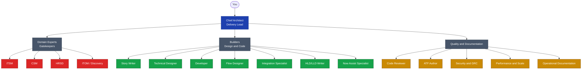

# Business Overview

**Repository:** [`farstic/claude-servicenow-live`](https://github.com/farstic/claude-servicenow-live)
**Purpose:** Explains what the engine does, who it works like, and why it makes ServiceNow delivery faster and safer. No code, no protocol mechanics — just the team metaphor and the value it produces.
**Audience:** Business Analysts · Project Managers · Product Owners · stakeholders
**Last updated:** 29 May 2026
**Reading time:** 10 minutes

---

## The one-sentence version

The engine is a virtual ServiceNow consulting team that always checks the platform's out-of-the-box capabilities before agreeing to build anything custom.

---

## What it feels like to use

You type a request. A senior architect (the "Chief Architect") reads it, decides which specialists are needed, asks them to do the work, reviews what comes back, and delivers it to you. The whole exchange happens in a single conversation — but behind the scenes, up to 24 named specialists may have contributed.

The Chief Architect is opinionated. If you ask for something that ServiceNow already does out of the box, the engine will tell you so before writing a line of code. If you ask for something genuinely custom, the engine will stop and ask for explicit approval before designing it. That pause is the engine's most valuable behaviour — it prevents the slow accumulation of unnecessary custom tables, scoped apps, and one-off scripts that destroy ServiceNow implementations over time.

---

## The virtual team

Three departments, one delivery lead, twenty-four named roles. Each has a specific job and never wanders out of their lane.

### Who does what

| Role | What they do |
|---|---|
| **Chief Architect** | Reads your request, decides which specialists are needed, supervises the work, signs off on the deliverable |
| **Domain Experts** (ITSM, CSM, HRSD, ITOM) | The gatekeepers. Before any builder starts, the relevant Domain Expert confirms whether baseline ServiceNow already covers the requirement |
| **Builders** | Produce the actual deliverables — Gherkin stories, technical designs, code, flows, integrations, HLDs, AI agentic workflows |
| **Now Assist Specialist** | Designs AI Agents, agentic workflows, Now Assist skills, and AI Control Tower governance — the intelligence layer on top of baseline ServiceNow |
| **Quality and Documentation** | Reviews code automatically, writes test suites, flags security and performance concerns, produces runbooks |

---

## What you actually get

| If you ask for… | You receive… |
|---|---|
| User stories for a feature | Sprint-ready Gherkin with acceptance criteria, plus the supporting stories you forgot (access control, audit, notifications, reporting, test coverage, documentation) |
| A technical design | Table model, ACL matrix, business rule list with reasoning, flow outline — grounded in actual ServiceNow Australia release tables and fields |
| Code | Production-quality JavaScript with comments, security checks, no hardcoded sys_ids, plus an automatic four-checklist code review on the way out |
| An integration design | Full architecture spec — payload, authentication, retry logic, error handling, MID Server placement, observability |
| An HLD or LLD | 8-section architecture document grounded in primary ServiceNow documentation, with explicit decision points highlighted |
| A runbook or KBA | Operator-friendly procedure, in the right register for the audience |

---

## Why the gatekeepers matter

The Domain Experts are not consultants you can skip. They are mandatory — every request that touches their domain goes through them first.

The reason is simple. Here's what happens *without* governance discipline:

> A team needs to log escalations on customer service cases. The developer hears the requirement and reaches for a custom table — eight custom fields, a custom business rule, two custom ACLs, a custom client script. The custom table works. It ships. Three years later, the team has 60 custom tables on top of baseline. Nobody remembers which are still needed. A ServiceNow upgrade breaks three of them. A new hire spends a week trying to understand why escalations live in a custom table when ServiceNow already has built-in escalation tracking. The right baseline solution was always there. Nobody asked.

The CSM Specialist gatekeeper would have caught that request. It would have checked the four baseline candidates — work notes, audit history, the built-in escalation field, and the Vancouver+ escalation table (correctly flagged as unavailable on older releases) — and surfaced one of two outcomes:

- **The baseline already covers it.** The team configures baseline, ships in days, no custom-table debt.
- **The baseline genuinely doesn't cover it.** The team is asked, in writing, *"baseline cannot cover this — do you approve a custom table?"* The decision is conscious, documented, reviewable.

This is the engine's most important rule. We call it **§1.1 Baseline-First**. In plain English: no custom anything is built without an explicit approval message from you.

---

## From design to delivery — connected to a live instance

The engine used to stop at the design. It would hand you a polished specification or a block of code, and a developer would type it into ServiceNow by hand.

It now connects directly to a ServiceNow instance. It can read the real configuration — so when a gatekeeper says *"baseline already covers this"*, it has checked the actual instance, not just the manual. And it can build approved work straight onto the instance: a script, an automation rule, a report.

That extra power comes with two extra safety gates, both designed to keep a machine that can change your instance firmly under human control:

| Gate | In plain English |
|---|---|
| **Write approval** | The engine will never change the instance off the back of a general instruction. Before every single change, it stops and asks *"shall I write this — yes or no?"* and names exactly what it's about to do. "Go ahead" earlier in the conversation is not enough; each change is its own explicit decision. |
| **Change tracking** | Every change the engine makes is automatically packaged into a ServiceNow **Update Set** — the standard container your team already uses to move work between environments. Nothing is ever left untracked or stranded outside change control. |

The result: the engine can move at the speed of a conversation, but every change to your instance is deliberate, named, logged, and promotable — exactly as a careful human would do it.

---

## What this means for your role

| If you are… | The engine helps you by… |
|---|---|
| **A Business Analyst** | Turning workshop notes and stakeholder requests into sprint-ready stories with the support stories you'd otherwise forget |
| **A Project Manager** | Sizing features into stories, identifying which specialists each one needs, flagging dependencies (security, performance, CMDB) before sprint planning starts |
| **A Solution Architect** | Producing HLDs and LLDs grounded in actual ServiceNow capability, not guesswork |
| **A Developer** | Getting code that references the right baseline tables, with an automatic review on the way out |
| **An Engagement Lead** | Seeing every custom-build proposal in writing before any work starts |

The engine is not optimised for speed. It's optimised for the right answer the first time. A 90-second baseline answer is faster than a six-week custom-build that has to be unwound later.

---

## Next steps

- Want to see it in action? Read [`USER-GUIDE-AND-EXAMPLES.md`](./USER-GUIDE-AND-EXAMPLES.md) for three worked scenarios.
- Want the technical detail? Read [`TECHNICAL-ARCHITECTURE.md`](./TECHNICAL-ARCHITECTURE.md).
- Ready to install? Read [`INSTALLATION-GUIDE.md`](./INSTALLATION-GUIDE.md).

---

*Documents the [Claude ServiceNow Architecture Engine](https://github.com/farstic/claude-servicenow-live) v2.6 for non-technical audiences.*
