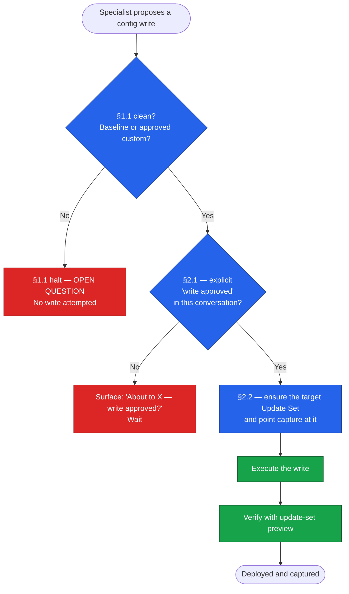

# MCP Operations Guide — Operating the Engine Against a Live Instance

**Repository:** [`farstic/claude-servicenow-live`](https://github.com/farstic/claude-servicenow-live)
**Purpose:** The operational playbook for the snowarch live-instance layer (MCP server key `servicenow`, tool prefix `mcp__servicenow__`). Covers how the engine reads and writes a live ServiceNow instance, the two mandatory approval gates that govern every write, and the patterns that make live deployment safe and reversible.
**Audience:** Architects and developers who run the engine against a live PDI or instance.
**Last updated:** 19 September 2026
**Prerequisite reading:** [`TECHNICAL-ARCHITECTURE.md`](./TECHNICAL-ARCHITECTURE.md) for the governance model (§1.1) this guide sits on top of.

---

## 1. What changed — design engine to delivery engine

Earlier versions of the engine were design-only. A specialist would produce a Script Include or a table model as text; a human would copy it into ServiceNow by hand. The engine could *reason about* a ServiceNow instance but could not *touch* one.

The snowarch MCP connection changes that. The engine now connects to a live ServiceNow instance and can:

- **Read** the actual state of the instance — table schemas, record counts, existing Script Includes, Business Rules, system properties, SLAs, and CMDB data.
- **Write** configuration objects directly — Script Includes, Business Rules, Script Actions, Update Sets, Reports, and more — which deploy to the instance the moment the call succeeds.

This is a material increase in capability and in risk. Two consequences follow, and they are the backbone of this guide:

1. **§1.1 Baseline-First verdicts are now validated against the live instance, not just `ServiceNowDocs/`.** When a Domain Expert asks "does baseline already cover this?", the engine can query the actual schema and confirm. A field the docs say exists is verified to exist on *this* instance before it is relied upon.
2. **Every write is gated.** Two protocols — §2.1 Write Approval and §2.2 Update Set Capture — stand between a proposed change and the live instance. Neither is optional. Both are described below.

---

## 2. Connection, presets and flags

The live-instance layer is **snowarch** — one repository that ships the engine and its MCP server (server key `servicenow`, tool prefix `mcp__servicenow__`, 397 tools declared in a pinned contract). The session targets a single instance at a time, addressed by its **label**. Instance URLs and credentials live only in the snowarch checkout's store `.local/instances.json` (file mode 0600, directory 0700), written by the `./snowarch mode live` wizard or by `./snowarch instance add <label> …` (see [`INSTALLATION-GUIDE.md`](./INSTALLATION-GUIDE.md) §Optional) — never in `~/.claude.json`, `.mcp.json`, environment variables, or Git. Examples in this repository always use `your-instance.service-now.com`.

Each instance carries an **environment** (`pdi` / `dev` / `test` / `prod`), a **preset** (`read-only` / `pdi-developer` / `full` / `custom`) and six capability **flags**. The flags gate the tool families:

| Flag | Gates |
|---|---|
| `WRITE_ENABLED` | Records, incidents, catalog, users, update sets |
| `CMDB_WRITE_ENABLED` | CMDB write tools |
| `SCRIPTING_ENABLED` | Script Includes, Business Rules, Flow actions, update-set creation |
| `ATF_ENABLED` | ATF tools |
| `NOW_ASSIST_ENABLED` | Now Assist tools |
| `FLUENT_ENABLED` | Fluent tools |

Probes verify each capability when the instance is saved; `./snowarch instance test <label>` re-runs them, and `./snowarch instance set-preset <label> <preset>` changes the preset. A `prod` instance keeps writes locked until `--ack-prod` (prodWriteAck). A refused call returns a code such as `SCRIPTING_NOT_ENABLED` with a remedy naming the label. `AUTHENTICATION_FAILED` means stop — do not retry — tell the user to run `./snowarch instance test <label>` and, if it fails, `./snowarch instance set-credentials <label>`, then call `snow_core_instances_reload` before retrying.

The `Mode:` line printed by the SessionStart hook (and by `./snowarch mode`, `./snowarch doctor` and `/snowarch status`) is the authoritative statement of design-only vs live. Enabling a flag or changing a preset is an **infrastructure change** — it is *not* a write approval. Having `WRITE_ENABLED` on does not authorise any specific write. See §3.

---

## 3. Gate 1 — The Write Approval Protocol (§2.1)

> **Every MCP write operation against the live instance requires an explicit "write approved" from the user, in the current conversation, naming the specific action.**

This applies to every tool that mutates instance state, whatever its name. Approval is per action.

### What counts as "write approved"

A clear, explicit user message in the current conversation that authorises the specific action about to be taken — for example: *"yes, create it"*, *"write approved"*, *"go ahead and deploy the Script Include"*.

### What does NOT count

- A preset or flag change (enabling `WRITE_ENABLED` on an instance is infrastructure, not approval).
- A previous "yes" to a read-only operation (approving a routing proposal or a Code Reviewer pass).
- A general earlier go-ahead that did not name the specific write.
- The user's original task description, however detailed.

### Halt protocol

If a write is about to execute without a matching approval in the current conversation, the engine stops and surfaces:

> `About to <action> on instance "<label>" — write approved?`

and waits. **Self-approval is prohibited:** the engine may not infer authorisation from context, urgency, or logical flow. Approval is always a discrete user message.

This gate is the live-instance analogue of the §1.1 halt: §1.1 protects the *architecture* from silent custom objects; §2.1 protects the *instance* from unapproved writes.

---

## 4. Gate 2 — The Update Set Capture Protocol (§2.2)

> **Before any write that produces a configuration object (Script Include, Business Rule, Client Script, UI Policy, UI Action, ACL, Flow, table or field), the target Update Set MUST be ensured and capture MUST be pointed at it — `snow_us_active_update_set_ensure`, then `snow_us_capture_target_set`.**

### Why this exists

ServiceNow REST API calls honour the authenticated user's `sys_user_preference` row with `name=sys_update_set`. Point capture at the target Update Set *before* writing, and ServiceNow captures the created or updated object automatically. The `is_default` flag on an update set is a UI concept and does nothing for the API. Skip the step, and the object lands on the instance but is captured in **no** Update Set — it cannot be promoted or migrated, and retroactive capture via REST is **not possible**.

### The mandatory pre-write sequence

1. **Ensure the target Update Set** — `snow_us_active_update_set_ensure` `{ "name": "<engagement>-<topic>" }`. The name is required, and only the caller's own in-progress sets are returned.
2. **Point capture at it** — `snow_us_capture_target_set` `{ "update_set_sys_id": "<sys_id from step 1>" }`.
3. **Execute the write** — with its own §2.1 approval; the object is now captured automatically.
4. **Verify capture** — `snow_us_update_set_preview` and confirm the objects are in the set. This step is the evidence.

The capture target is stored in the ServiceNow database, not on the local machine, so the protocol works on any instance and any laptop. If steps 1–2 were skipped before a write, stop and say so — capture cannot be applied retroactively over REST. If `snow_us_capture_target_set` is not advertised, the registered server predates snowarch 2.0.0 and this protocol cannot run — stop and say so rather than improvising a capture.

### What does NOT work (confirmed)

| Approach | Why it fails |
|---|---|
| `snow_us_update_set_switch` | Sets `is_default` on the Update Set record; changes **nothing** for REST |
| Writing `sys_update_xml` directly | Refused with `INSUFFICIENT_PRIVILEGES`, admin included |
| `snow_deploy_background_script_exec` / `snow_fluent_script_exec` | Refuse with `UNSUPPORTED_ON_THIS_INSTANCE` |

Full detail and the running list of confirmed platform behaviours live in [`snowarch-field-notes.md`](./snowarch-field-notes.md).

---

## 5. The two gates in sequence

A configuration write is only correct when **both** gates are satisfied, in this order:

Order matters. §1.1 is resolved first (is the *architecture* sound?), then §2.1 (is the *write* authorised?), then §2.2 (will the write be *captured*?). A write that skips any step is a defect.

---

## 6. Read vs write tool patterns

### Reads (no gate required)

Read tools are safe to call freely and are the engine's primary means of validating §1.1 verdicts against the live instance:

- Table-schema and table-discovery reads (`snow_core_table_schema_read`, `snow_disco_table_discover`) — confirm a field or table exists *on this instance*.
- Record reads and queries (`snow_core_records_query`, `snow_core_record_read`) — inspect data and volumes.
- Script inventories (`snow_scr_business_rules_index`, `snow_scr_script_includes_index`) — audit existing config before proposing new.
- Update-set reads (`snow_us_current_update_set_read`, `snow_us_update_sets_index`, `snow_us_update_set_preview`) — confirm capture context.

The `_read`, `_query` and `_index` suffixes mark the read families; none of them requires the gate.

### Writes (both gates required)

Every tool in this group is subject to §2.1 and §2.2:

- Script Include and Business Rule `_add` / `_modify` calls (`snow_scr_script_include_add`, `snow_scr_business_rule_add`, and their `_modify` counterparts)
- Generic record writes (`snow_core_record_add` / `snow_core_record_modify`) when producing a config object
- Update-set, report and scheduled-job `_add` calls, and the rest of the `_add` / `_modify` / `_remove` / `_exec` / `_publish` family — a suffix that is not on this list does not exempt a call that changes instance state.

### Known write gotchas (patch-after-create)

Several create-family tools have been observed to leave required fields unset. These are documented in full in [`snowarch-field-notes.md`](./snowarch-field-notes.md) — recorded against the previous server's tools, so re-verify each one on the first snowarch write of that object type; the headline ones:

| Object | Gotcha | Fix |
|---|---|---|
| Business Rule create | `action_insert` / `action_update` default to `false` — the BR never fires | Set `action_insert` / `action_update` with a `_modify` call on `sys_script` immediately after |
| Event registration | Leaves `event_name` blank — Script Actions never match | Patch `event_name` and `suffix` immediately after |
| Flow / Flow Action create | Create empty shells with no steps — unusable over the API | Build the flow in the Flow Designer UI |
| Email from server script | `gs.sendEmail()` bypasses `sys_email` on PDI | Insert directly into `sys_email` via GlideRecord (see field notes §3) |

**Standing rule:** whenever a platform behaviour is discovered, confirmed, or worked around during a session, record it in `snowarch-field-notes.md`, commit, and push. That file is the single source of live-instance operational truth across machines.

---

## 7. Quick reference — the operator's checklist

Before deploying anything to a live instance:

- [ ] §1.1 resolved — baseline confirmed against live schema, or custom object explicitly approved.
- [ ] §2.1 — explicit "write approved" for *this* action exists in the current conversation.
- [ ] §2.2 step 1 — `snow_us_active_update_set_ensure` returned the target Update Set (named `<engagement>-<topic>`, *in progress*).
- [ ] §2.2 step 2 — `snow_us_capture_target_set` points capture at that Update Set.
- [ ] §2.2 step 3 — write executed.
- [ ] §2.2 step 4 — `snow_us_update_set_preview` shows the object in the set.
- [ ] Any patch-after-create gotcha applied (BR actions, event_name, etc.).
- [ ] Any new platform behaviour recorded in `snowarch-field-notes.md`.

---

## 8. Where to next

- The artefacts already deployed under this protocol: [`LIVE-ARTEFACTS-CATALOGUE.md`](./LIVE-ARTEFACTS-CATALOGUE.md).
- The governance model these gates protect: [`TECHNICAL-ARCHITECTURE.md`](./TECHNICAL-ARCHITECTURE.md).
- The running list of confirmed platform behaviours: [`snowarch-field-notes.md`](./snowarch-field-notes.md).

---

*Documents the live-instance operating model for the [Claude ServiceNow Architecture Engine](https://github.com/farstic/claude-servicenow-live) v2.6.*
