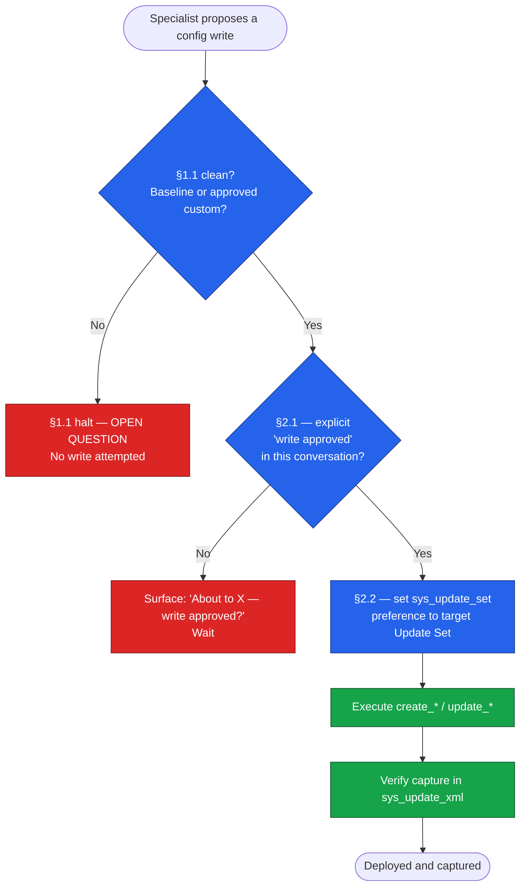

# MCP Operations Guide — Operating the Engine Against a Live Instance

**Repository:** [`farstic/claude-servicenow-live`](https://github.com/farstic/claude-servicenow-live)
**Purpose:** The operational playbook for the NowAIKit MCP connection. Covers how the engine reads and writes a live ServiceNow instance, the two mandatory approval gates that govern every write, and the patterns that make live deployment safe and reversible.
**Audience:** Architects and developers who run the engine against a live PDI or instance.
**Last updated:** 29 May 2026
**Prerequisite reading:** [`TECHNICAL-ARCHITECTURE.md`](./TECHNICAL-ARCHITECTURE.md) for the governance model (§1.1) this guide sits on top of.

---

## 1. What changed — design engine to delivery engine

Earlier versions of the engine were design-only. A specialist would produce a Script Include or a table model as text; a human would copy it into ServiceNow by hand. The engine could *reason about* a ServiceNow instance but could not *touch* one.

The NowAIKit MCP connection changes that. The engine now connects to a live ServiceNow instance and can:

- **Read** the actual state of the instance — table schemas, record counts, existing Script Includes, Business Rules, system properties, SLAs, and CMDB data.
- **Write** configuration objects directly — Script Includes, Business Rules, Script Actions, Update Sets, Reports, and more — which deploy to the instance the moment the call succeeds.

This is a material increase in capability and in risk. Two consequences follow, and they are the backbone of this guide:

1. **§1.1 Baseline-First verdicts are now validated against the live instance, not just `ServiceNowDocs/`.** When a Domain Expert asks "does baseline already cover this?", the engine can query the actual schema and confirm. A field the docs say exists is verified to exist on *this* instance before it is relied upon.
2. **Every write is gated.** Two protocols — §2.1 Write Approval and §2.2 Update Set Capture — stand between a proposed change and the live instance. Neither is optional. Both are described below.

---

## 2. Connection and permission tiers

The MCP connection targets a single instance at a time. Instance URL and credentials are configured locally (see [`INSTALLATION-GUIDE.md`](./INSTALLATION-GUIDE.md) §MCP setup) and never appear in committed files — examples in this repository always use `your-instance.service-now.com`.

The connection operates at a declared **permission tier**:

| Tier | Capability | Use when |
|---|---|---|
| **Tier 0** | No MCP access | Pure design work; air-gapped review |
| **Tier 1** | Read-only | Validating §1.1 verdicts against live schema; auditing existing config |
| **Tier 1 (Read-Write)** | Read + write | Deploying artefacts to a non-production instance (PDI) |

A tier upgrade is an **infrastructure change** — it is *not* a write approval. Being in Read-Write tier does not authorise any specific write. See §3.

---

## 3. Gate 1 — The Write Approval Protocol (§2.1)

> **Every MCP write operation against the live instance requires an explicit "write approved" from the user, in the current conversation, naming the specific action.**

This applies to every `create_*`, `update_*`, `delete_*`, and any other tool that mutates instance state.

### What counts as "write approved"

A clear, explicit user message in the current conversation that authorises the specific action about to be taken — for example: *"yes, create it"*, *"write approved"*, *"go ahead and deploy the Script Include"*.

### What does NOT count

- A permission-tier upgrade (Tier 0 → Tier 1 is infrastructure, not approval).
- A previous "yes" to a read-only operation (approving a routing proposal or a Code Reviewer pass).
- A general earlier go-ahead that did not name the specific write.
- The user's original task description, however detailed.

### Halt protocol

If a write is about to execute without a matching approval in the current conversation, the engine stops and surfaces:

> *"About to [describe the specific action] — write approved?"*

and waits. **Self-approval is prohibited:** the engine may not infer authorisation from context, urgency, or logical flow. Approval is always a discrete user message.

This gate is the live-instance analogue of the §1.1 halt: §1.1 protects the *architecture* from silent custom objects; §2.1 protects the *instance* from unapproved writes.

---

## 4. Gate 2 — The Update Set Capture Protocol (§2.2)

> **Before any `create_*` or `update_*` that produces a configuration object, the active `sys_update_set` user preference MUST point at the target Update Set for the authenticated user.**

### Why this exists

ServiceNow REST API calls honour the `sys_user_preference` record named `sys_update_set` for the authenticated user. Set that preference to the target Update Set *before* writing, and ServiceNow captures the created or updated object automatically. Skip it, and the object lands on the instance but is captured in **no** Update Set — it cannot be promoted or migrated, and retroactive capture via REST is **not possible**.

### The mandatory pre-write sequence

1. **Identify or create the target Update Set** — `create_update_set`, or confirm an existing one is *in progress*.
2. **Resolve the authenticated user's sys_id** — `query_records(sys_user, user_name=<username>)`.
3. **Set the user preference** — `query_records(sys_user_preference, user=<sys_id>^name=sys_update_set)`:
   - If it exists → `update_record(sys_user_preference, <pref_sys_id>, {value: <update_set_sys_id>})`
   - If not → `create_record(sys_user_preference, {user: <sys_id>, name: 'sys_update_set', value: <update_set_sys_id>, type: 'string'})`
4. **Execute the write** — the object is now captured automatically.
5. **Verify capture** — `query_records(sys_update_xml, update_set=<update_set_sys_id>)` and confirm the object appears.

This protocol is **environment-agnostic** — the preference is stored in the ServiceNow database, not on the local machine, so it works on any instance and any laptop. On a new instance, run steps 2–3 once for the authenticated user.

### What does NOT work (confirmed)

| Approach | Why it fails |
|---|---|
| `switch_update_set` | Only sets `is_default: true` on the Update Set record; does **not** switch session context |
| Direct POST to `sys_update_xml` | Blocked by `INSUFFICIENT_PRIVILEGES`, even for admins |
| `execute_script` / `execute_background_script` | Call endpoints that do not exist on PDI; fail with 400/404 |

Full detail and the running list of confirmed MCP behaviours live in [`nowaikit-field-notes.md`](./nowaikit-field-notes.md).

---

## 5. The two gates in sequence

A configuration write is only correct when **both** gates are satisfied, in this order:

Order matters. §1.1 is resolved first (is the *architecture* sound?), then §2.1 (is the *write* authorised?), then §2.2 (will the write be *captured*?). A write that skips any step is a defect.

---

## 6. Read vs write tool patterns

### Reads (no gate required)

Read tools are safe to call freely and are the engine's primary means of validating §1.1 verdicts against the live instance:

- `get_table_schema`, `discover_table`, `check_table_completeness` — confirm a field or table exists *on this instance*.
- `query_records`, `get_record`, `run_aggregate_query` — inspect data and volumes.
- `list_business_rules`, `list_script_includes`, `get_script_include` — audit existing config before proposing new.
- `get_current_update_set`, `list_update_sets` — confirm capture context.

### Writes (both gates required)

Every tool in this group is subject to §2.1 and §2.2:

- `create_script_include` / `update_script_include`
- `create_business_rule` / `update_business_rule`
- `create_record` / `update_record` (when producing a config object)
- `create_update_set`, `create_report`, `create_scheduled_job`, and the rest of the `create_*` / `update_*` / `delete_*` family.

### Known write gotchas (patch-after-create)

Several `create_*` tools leave required fields unset. These are documented in full in [`nowaikit-field-notes.md`](./nowaikit-field-notes.md); the headline ones:

| Tool | Gotcha | Fix |
|---|---|---|
| `create_business_rule` | `action_insert` / `action_update` default to `false` — the BR never fires | `update_record(sys_script, …, {action_insert: true, action_update: true})` immediately after |
| `register_event` | Leaves `event_name` blank — Script Actions never match | Patch `event_name` and `suffix` immediately after |
| `create_flow` / `create_flow_action` | Create empty shells with no steps — unusable via MCP | Build the flow in the Flow Designer UI |
| Email from server script | `gs.sendEmail()` bypasses `sys_email` on PDI | Insert directly into `sys_email` via GlideRecord (see field notes §3) |

**Standing rule:** whenever a tool behaviour is discovered, confirmed, or worked around during a session, record it in `nowaikit-field-notes.md`, commit, and push. That file is the single source of MCP operational truth across machines.

---

## 7. Quick reference — the operator's checklist

Before deploying anything to a live instance:

- [ ] §1.1 resolved — baseline confirmed against live schema, or custom object explicitly approved.
- [ ] §2.1 — explicit "write approved" for *this* action exists in the current conversation.
- [ ] §2.2 step 1 — target Update Set exists and is *in progress*.
- [ ] §2.2 steps 2–3 — `sys_update_set` preference points at that Update Set.
- [ ] Write executed.
- [ ] §2.2 step 5 — capture verified in `sys_update_xml`.
- [ ] Any patch-after-create gotcha applied (BR actions, event_name, etc.).
- [ ] Any new tool behaviour recorded in `nowaikit-field-notes.md`.

---

## 8. Where to next

- The artefacts already deployed under this protocol: [`LIVE-ARTEFACTS-CATALOGUE.md`](./LIVE-ARTEFACTS-CATALOGUE.md).
- The governance model these gates protect: [`TECHNICAL-ARCHITECTURE.md`](./TECHNICAL-ARCHITECTURE.md).
- The running list of confirmed MCP behaviours: [`nowaikit-field-notes.md`](./nowaikit-field-notes.md).

---

*Documents the live-instance operating model for the [Claude ServiceNow Architecture Engine](https://github.com/farstic/claude-servicenow-live) v2.6.*
