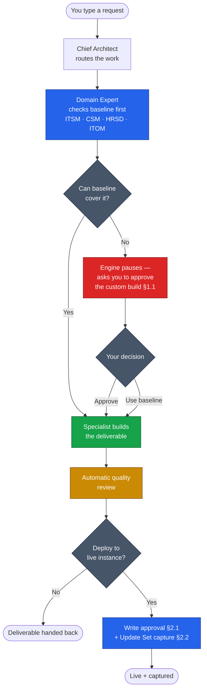

# Documentation Hub — Claude ServiceNow Architecture Engine

[](./CHANGELOG.md)
[](https://claude.ai)
[](https://www.servicenow.com)
[](https://www.anthropic.com)

**Repository:** [`farstic/claude-servicenow-live`](https://github.com/farstic/claude-servicenow-live)
**Purpose:** The entry point to the engine's documentation suite — what the engine is, and which document to read for what.
**Audience:** Everyone. Start here, then branch by role.
**Last updated:** 29 May 2026

> A virtual ServiceNow consulting team — powered by Claude — that writes stories, designs, code, and test suites, **validates them against a live ServiceNow instance**, and deploys approved work under strict change control — without ever silently inventing a custom table.

---

## What the engine does

Type a ServiceNow request. The engine routes it through the right specialist, checks it against ServiceNow's out-of-the-box capabilities (now confirmed against the **live instance schema**, not just the manuals), produces the deliverable, runs an automatic quality review, and — when you approve — **deploys it directly to your instance** inside a tracked Update Set.

| You get | How |
|---|---|
| **Sprint-ready user stories** | Story Writer produces Gherkin with acceptance criteria and the supporting stories you forgot |
| **Architecture you can ship** | Domain Experts (ITSM · CSM · HRSD · ITOM) check every request against baseline ServiceNow before approving any custom build |
| **Code with a built-in review** | Every JavaScript artefact gets an automatic style + performance + security + best-practice check |
| **Live validation and deployment** | Reads the real instance to confirm baseline; deploys approved artefacts directly — gated by write approval and Update Set capture |
| **No accidental tech debt** | The engine refuses to silently invent custom tables — it stops, shows the baseline alternatives, and waits for your decision |
| **No ungoverned writes** | Nothing reaches the instance without an explicit, named "write approved" — and everything lands in an Update Set |

---

## How it works



---

## The documentation suite

Read in this order if you're new; jump by role if you're not.

| Doc | For | Read time |
|---|---|---|
| **[Installation Guide](./INSTALLATION-GUIDE.md)** | First-time setup (+ optional live-instance MCP) | 2–5 min |
| **[Business Overview](./BUSINESS-OVERVIEW.md)** | BAs · PMs · stakeholders — the team metaphor and value | 10 min |
| **[User Guide and Examples](./USER-GUIDE-AND-EXAMPLES.md)** | Everyone — four worked scenarios incl. live deploy | 18 min |
| **[Technical Architecture](./TECHNICAL-ARCHITECTURE.md)** | Developers/maintainers — the full protocol mechanics | 25 min |
| **[MCP Operations Guide](./MCP-OPERATIONS-GUIDE.md)** | Anyone running the engine against a live instance | 12 min |
| **[Live Artefacts Catalogue](./LIVE-ARTEFACTS-CATALOGUE.md)** | What's deployed, and on what baseline tables | 5 min |
| **[NowAIKit Field Notes](./nowaikit-field-notes.md)** | Confirmed MCP behaviours and workarounds | reference |
| **[Advanced Web Setup](./ADVANCED-WEB-SETUP.md)** | Optional Claude.ai browser front-end (design-only) | 10 min |
| **[Changelog](./CHANGELOG.md)** | Version history | 5 min |
| **[Diagram Import Notes](./IMPORT-NOTES.md)** | Editable-diagram conventions | reference |

Architecture visuals currently render as **Mermaid** inside the markdown docs above; see [Diagram Import Notes](./IMPORT-NOTES.md) for the editable-source convention.

---

## Quick start

```bash
# 1. Install Claude Code CLI (one-time)
npm install -g @anthropic-ai/claude-code

# 2. Clone the engine (with submodules — pulls the ServiceNow reference docs)
git clone --recurse-submodules https://github.com/farstic/claude-servicenow-live
cd claude-servicenow-live

# 3. Run it
claude
```

At the `❯` prompt, type `Status`. You should see the Chief Architect roster with four Domain Experts loaded. To connect a live instance, follow the optional MCP step in the [Installation Guide](./INSTALLATION-GUIDE.md).

---

## Try it

Once `claude` is running, paste any of these.

**For Business Analysts** — sprint-ready stories:
> *We had a workshop on incident escalation. L1 agents need to escalate to L2 with a reason, notify the on-call engineer, and produce a weekly report. Please give me Gherkin stories. ITSM module, Australia release.*

**For Architects** — integration design:
> *Design the integration that posts resolved P1/P2 incidents from ServiceNow to Azure DevOps. Volume ~100/day, OAuth2, MID Server required.*

**For Developers** — the engine's most distinctive behaviour:
> *Design and implement a custom audit log table for CSM case escalations. Show me the table model.*

The third produces a **pause**, not a table model — the engine surfaces baseline alternatives and asks for your explicit decision. That's §1.1 Baseline-First in action. Full walkthroughs (including live deployment) in the [User Guide](./USER-GUIDE-AND-EXAMPLES.md).

---

## What's inside the repository

```
claude-servicenow-live/
├── CLAUDE.md                 ← Chief Architect persona (v2.6)
├── governance-rules.md       ← Authoritative §1.1 source
├── taxonomy.md               ← Specialist boundaries and routing
├── prompt-patterns.md        ← Reusable prompt templates (PP-01…PP-18)
├── VALIDATION-TESTS.md       ← 10 regression tests (all passing)
│
├── skills/                   ← 12 specialist skills (source of truth)
├── agents/                   ← 7 sub-agent definitions
├── .claude/                  ← Pre-synced mirror Claude Code reads from
├── .githooks/                ← pre-commit auto-sync hook
├── scripts/                  ← sync-agents-skills.sh
│
├── ServiceNowDocs/           ← Submodule, Australia release branch
└── docs/                     ← This documentation suite
```

The `.claude/` mirror ships pre-synced and is kept aligned automatically by the pre-commit hook — after `git clone`, no setup is required.

---

## Current state

- **Engine version:** v2.6
- **Release family:** Australia
- **Domain Expert gateways:** ITSM · CSM · HRSD · ITOM/Discovery
- **Live instance:** NowAIKit MCP connected; §1.1 validated against the real schema
- **Write governance:** §2.1 write approval + §2.2 Update Set capture, both mandatory
- **Deployed artefacts:** 3, all baseline-only (see [Live Artefacts Catalogue](./LIVE-ARTEFACTS-CATALOGUE.md))
- **Regression suite:** 10 tests, all passing

---

## License

**Proprietary — Enterprise Architecture Team. All rights reserved.** Internal use only; not licensed for redistribution.

---

*Documentation hub for the [Claude ServiceNow Architecture Engine](https://github.com/farstic/claude-servicenow-live) v2.6. Built on [Anthropic Claude](https://www.anthropic.com/claude), grounded in [ServiceNow](https://www.servicenow.com) Australia-release primary documentation.*
