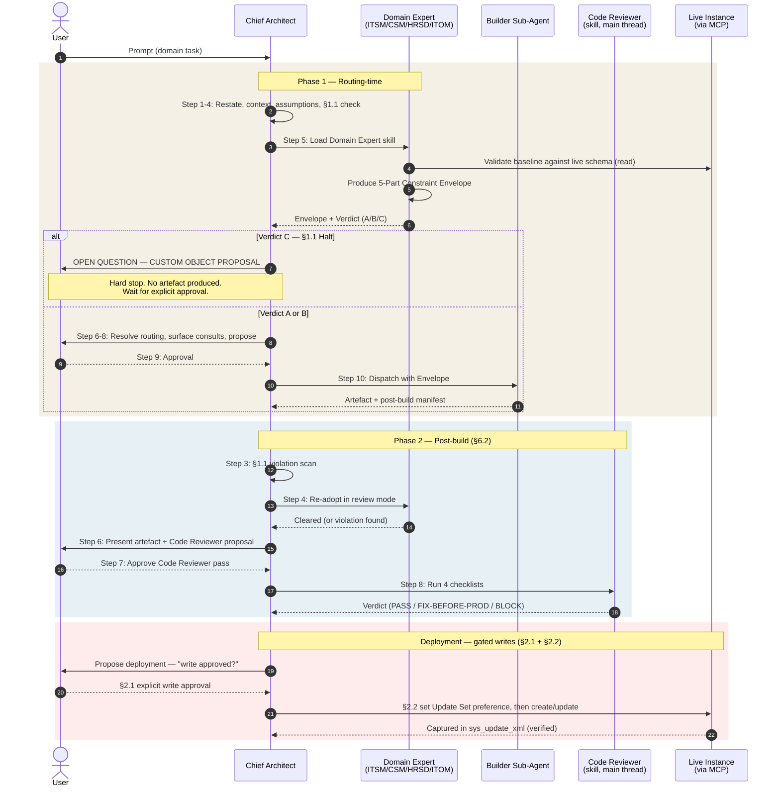

# Technical Architecture

**Repository:** [`farstic/claude-servicenow-live`](https://github.com/farstic/claude-servicenow-live)
**Purpose:** Specifies the mechanics of the engine in the detail required to extend, debug, or audit it — the governance model, the routing protocol, the live-instance execution layer, and the repository machinery that keeps it consistent.
**Audience:** Developers · Architects · Engine maintainers
**Last updated:** 29 May 2026
**Reading time:** 25 minutes

If you just want to *use* the engine, read [`USER-GUIDE-AND-EXAMPLES.md`](./USER-GUIDE-AND-EXAMPLES.md) instead.

> **Source of truth.** The authoritative governance source is `governance-rules.md` at repo root. The authoritative routing source is `taxonomy.md`. The Chief Architect persona is defined in `CLAUDE.md` (Claude Code); a Tier 1 (Claude.ai) `master-project-instructions.md` is planned but **not yet shipped**. Where this document and any of those drift, the source files win.

---

## 0. What this version is — design *and* delivery

Through v2.3 the engine was a **design** engine: it reasoned about ServiceNow and produced artefacts as text, which a human deployed by hand. From v2.4 onward a live **NowAIKit MCP** connection lets the engine read and write a real ServiceNow instance directly. The engine now both designs *and* delivers.

Two governance consequences run through this whole document:

1. **§1.1 verdicts are validated against the live instance**, not only against `ServiceNowDocs/`. A baseline field is verified to exist on *this* instance before it is relied on.
2. **Every write is gated** by §2.1 (Write Approval) and §2.2 (Update Set Capture). The operational detail of both lives in [`MCP-OPERATIONS-GUIDE.md`](./MCP-OPERATIONS-GUIDE.md); their place in the architecture is §5 below.

---

## 1. The §1.1 Baseline-First rule

§1.1 is the engine's most consequential governance rule:

> No specialist — skill or sub-agent — may propose, design, or create custom tables, custom scoped applications, custom state-model extensions, custom Connection & Credential Aliases, or any other major custom architectural object without the Chief Architect's explicit, prior approval captured in the routing-time dispatch envelope.

### 1.1.1 Baseline candidates the specialist must evaluate first

Before proposing any custom object, the specialist must identify whether a baseline ServiceNow construct can serve the requirement. The mandatory evaluation set:

- An existing baseline table (`incident`, `sn_customerservice_case`, `sn_hr_core_case`, `task`, `sys_user_group`, `change_request`, etc.)
- The baseline scope of the relevant module
- The `work_notes` or `comments` journal field for audit trail or commentary
- Baseline audit history (`sys_history_set`) for record-level audit
- Baseline state values and field choices
- System properties for instance-wide configuration
- Existing baseline business rules, flows, or Script Includes
- Configuration options over custom code

Baseline solutions are accepted without further approval and are always preferred over custom equivalents. **With MCP connected, "does this baseline construct exist?" is now answered by querying the live schema** (`get_table_schema`, `discover_table`) rather than relying on documentation alone.

### 1.1.2 The halt protocol — `OPEN QUESTION — CUSTOM OBJECT PROPOSAL`

If a custom object is genuinely the only viable technical path, the specialist **must halt before designing it** and return a blocking `OPEN QUESTION — CUSTOM OBJECT PROPOSAL` containing four parts:

1. **Baseline option evaluated** — what baseline construct was considered, and why it falls short.
2. **Custom object proposed** — at the smallest possible scope, following this hierarchy (least to most invasive):
   - A new field on a baseline table *(preferred)*
   - A new table extending a baseline table, in the baseline scope
   - A new table extending a baseline table, in a pre-existing scoped app
   - A new top-level table in a pre-existing scoped app
   - A new top-level table in a new scoped app
   - A new scoped app
3. **Consequences of approval** — data model impact, deployment dependency, support cost, upgrade risk.
4. **Alternatives if rejected** — degraded design, deferred functionality, manual workaround.

### 1.1.3 Self-authorization is prohibited

The user's original request — however specific or detailed — **does not constitute Chief Architect approval** of a custom object. Approval must arrive as an explicit, separate user message responding to the OPEN QUESTION. This rule was hardened in v2.3 after a model bypassed the gate by treating a detailed request as retroactive authorization; it is regression-tested by **T-10** in `VALIDATION-TESTS.md`.

### 1.1.4 Violation detection (Phase 2)

The Chief Architect inspects every returned artefact for §1.1 violations. Signals:

- A new table name (`x_*_*` or any non-baseline `<scope>_<table>`) not in the dispatch envelope
- A new scoped app prefix not in the dispatch envelope
- New Connection & Credential Aliases, state values, or `sys_user_group` structures not in the dispatch envelope

A violation halts the §6.2 flow and re-dispatches the originating specialist with the §1.1 halt protocol as the rework brief. **Crucially, the violation scan now runs before any write reaches the instance** — §1.1 is resolved first, then the §2.1/§2.2 write gates (see §5.4).

---

## 2. The 5-Part Constraint Envelope

When a task touches a domain covered by a Domain Expert (ITSM, CSM, HRSD, ITOM/Discovery, CMDB & CSDM), the Chief Architect routes to that Domain Expert **first**. The Domain Expert produces a standardised output called the 5-Part Constraint Envelope.

| Part | Content |
|---|---|
| **1 — OOB Process Map** | The out-of-the-box ServiceNow process as it exists in the locked release family (Australia by default) |
| **2 — Data Model Alignment** | Every baseline table, field, state value, and system property relevant to the requirement — confirmed against the live schema where MCP is connected |
| **3 — §1.1 Verdict** | A (fully baseline), B (baseline with constrained extension), or C (§1.1 halt) |
| **4 — Routing Recommendation** | Which builder is dispatched, with what constraints inherited from Parts 1–3 |
| **5 — Anti-Patterns** | Known bad implementations to avoid |

The Envelope is the dispatch envelope for downstream builders. A builder that proposes a table not in Part 2 produces a §1.1 violation by definition.

### Verdict semantics

| Verdict | Meaning | What happens |
|---|---|---|
| **A** | Fully baseline — configuration only | Builder may be dispatched; no custom object |
| **B** | Baseline with constrained extension (e.g. one field on a baseline table) | Builder dispatched with constraint in the envelope |
| **C** | No baseline construct covers it — custom object required | Halt. OPEN QUESTION surfaced. No design artefact produced until explicit user approval arrives |

All three live artefacts in [`LIVE-ARTEFACTS-CATALOGUE.md`](./LIVE-ARTEFACTS-CATALOGUE.md) are **Verdict A** — the intended steady state.

---

## 3. The two-phase routing protocol

### 3.1 Phase 1 — Routing-time (taxonomy §6.1)

1. Restate the task
2. Read engagement context if applicable
3. Surface assumptions and open questions
4. Evaluate §1.1 Baseline-First implications
5. **Apply the Domain Expert gateway.** Load the relevant skill; produce the 5-Part Envelope; Verdict A or B continues, Verdict C halts.
6. Resolve routing ambiguity using `taxonomy.md`
7. Surface routing-time consults (Performance & Scale, Security & GRC, CMDB & CSDM, DevOps)
8. Propose the primary specialist
9. Wait for user approval
10. Invoke the sub-agent via Task tool with envelope + context
11. Review the output
12. Run Phase 2 before presenting as final

### 3.2 Phase 2 — Post-build (taxonomy §6.2)

1. Hold the artefact
2. Classify content
3. Inspect for §1.1 violations
4. **Domain Expert post-build review.** Re-adopt the same Domain Expert in review mode; validate the artefact against the original Envelope.
5. Evaluate §3.2 post-build consult triggers (Code Reviewer for JS, ATF Author for release-path artefacts, Operational Documentation for go-live signals)
6. Present artefact + consult proposals together
7. Wait for user decisions
8. On Code Reviewer approval: adopt skill in main thread, run four checklists
9. On REWORK verdict: propose handoff back to originating builder with findings

---

## 4. Full lifecycle — sequence diagram

---

## 5. Live-instance execution layer

This is the layer added in the MCP era. Full operational procedure is in [`MCP-OPERATIONS-GUIDE.md`](./MCP-OPERATIONS-GUIDE.md); this section places it in the architecture.

### 5.1 The MCP connection

The engine connects to one instance at a time at a declared permission tier (Tier 0 none / Tier 1 read-only / Tier 1 Read-Write). Instance URL and credentials are local-only and never committed; examples use `your-instance.service-now.com`. A tier upgrade is infrastructure, not write authorisation.

### 5.2 §2.1 — Write Approval gate

Every MCP write requires an explicit "write approved" message naming the specific action, in the current conversation. A tier upgrade, a prior read-only "yes", a general go-ahead, or the original task description do **not** count. Self-approval is prohibited. Regression-tested by **T-05**.

### 5.3 §2.2 — Update Set Capture gate

Before any config write, the authenticated user's `sys_update_set` preference must point at the target Update Set, so ServiceNow captures the object automatically. Retroactive capture via REST is impossible. `switch_update_set` does **not** switch session context. Regression-tested by **T-06**. Full sequence in the MCP guide §4.

### 5.4 Gate order

The three checks are strictly ordered: **§1.1 (architecture) → §2.1 (authorisation) → §2.2 (capture) → write → verify.** A write that skips any step is a defect. This ordering is why §1.1 violation detection (Phase 2 Step 3) is upstream of any instance write.

---

## 6. Specialist contracts

### 6.1 Input contract — what the Chief Architect provides on dispatch

| Input | Required | Source |
|---|---|---|
| Cleaned-up task | Yes | Restated from user prompt |
| Engagement context | Conditional | From `clients/<client>/` if engaged |
| 5-Part Constraint Envelope | Yes for domain tasks | Produced by Domain Expert at Phase 1 Step 5 |
| Routing-time consults flagged | Conditional | Per taxonomy §3.1 |
| Scoped app prefix | Conditional | From engagement context (e.g. `x_acme_itsm`) |
| Release family | Yes | Australia by default |
| Output location | Yes | Repo path, chat-only, or live instance via MCP |

### 6.2 Output contract — what every builder returns

1. The primary artefact (code, design, flow spec, integration spec, stories)
2. A post-build proposal manifest naming §3.2 consults the Chief Architect should evaluate
3. OPEN QUESTIONS block for client decisions before build
4. Handoff manifest naming downstream specialists who consume this artefact

### 6.3 The roster — 8 sub-agents, 25 skills

| Builder | SKILL.md | Sub-agent | Output |
|---|---|---|---|
| Story Writer | `skills/story-writer/` | `agents/story-writer.md` | Gherkin Feature files |
| HLD/LLD Writer | `skills/hld-lld-writer/` | `agents/hld-lld-writer.md` | HLD / LLD / PDD documents |
| Technical Designer | `skills/technical-designer/` | `agents/technical-designer.md` | Table models, ACLs, BR lists |
| Developer | `skills/developer/` | `agents/developer.md` | Script Includes, BRs, Client Scripts |
| Flow Designer Specialist | `skills/flow-designer-specialist/` | `agents/flow-designer-specialist.md` | Flow / subflow / custom Action specs |
| Integration Specialist | `skills/integration-specialist/` | `agents/integration-specialist.md` | REST/SOAP integrations, IH spokes |
| Now Assist Specialist | `skills/now-assist-specialist/` | `agents/now-assist-specialist.md` | AI Agents, agentic workflows, skills |

**Skill-only specialists** (no sub-agent): Code Reviewer; the five Domain Experts (ITSM, CSM, HRSD, ITOM/Discovery, CMDB & CSDM); Security & GRC and Operational Documentation; and the consult roster (Performance & Scale, DevOps/Release, SPM, App Engine, Migration, UI/UX, Reporting & Analytics, Discovery). **ATF Author** runs both ways — a skill for single-component coverage and the `agents/atf-author.md` sub-agent for full-app batch suites.

### 6.4 Builder-pair routing rules

1. **Integration Specialist owns the plumbing** — REST/SOAP, IntegrationHub spokes, MID Server, Connection & Credential Aliases, auth, retry, DLQ.
2. **Flow Designer Specialist owns the orchestration** — the flow that uses the integration, the trigger, the branching, the approval steps.
3. **Developer owns the code** — JavaScript inside any Script Include, Business Rule, Client Script, or custom Action server script.
4. **Multi-step tasks are sequenced, not collapsed** — a request spanning multiple jurisdictions produces a sequenced plan with approval before the first dispatch (regression-tested by **T-03**).

---

## 7. Cross-cutting consult relationships

### 7.1 Routing-time consults (taxonomy §3.1) — before specialist invocation

| Consultant | Trigger |
|---|---|
| Performance & Scale Specialist | Volume >1M records; async/batch design; large-table query patterns |
| Security & GRC Specialist | Non-trivial ACL design; PII handling; SecOps; GDPR/regulatory; sensitive integrations |
| CMDB & CSDM Specialist | CI relationship modelling; IRE rules; writes to `cmdb_*` tables; CSDM phase decisions |
| DevOps / Release Manager | New scoped apps; update set strategy; deployment pipeline |

### 7.2 Post-build consults (taxonomy §3.2) — after builder returns

| Consultant | Signal | Action |
|---|---|---|
| Domain Expert | Task came through gateway at Phase 1 Step 5 | Re-adopt in review mode at Phase 2 Step 4 |
| Code Reviewer | JS code block present | Propose verbatim §6.2 prompt |
| ATF Author | Release-path bound | Propose skill mode |
| Operational Documentation | Go-live signals — `ready for prod`, `sign-off`, `release`, `go-live`, `cutover`, `deploy` | Propose runbook + KBA |

---

## 8. The validation suite

Behaviour is locked by `VALIDATION-TESTS.md` at repo root — **10 regression tests, all passing**. Run the suite before every commit that touches `CLAUDE.md`, `taxonomy.md`, `governance-rules.md`, or any `SKILL.md`. Each test gives a verbatim prompt and pass criteria; paste into a fresh session and compare.

| Test | Covers |
|---|---|
| **T-01** | §6.2 post-build hook — Code Reviewer fires automatically |
| **T-02** | §1.1 Baseline-First — custom object halts the pipeline |
| **T-03** | Routing — multi-builder sequencing |
| **T-04** | Domain Expert gateway fires even when a builder is named explicitly |
| **T-05** | MCP write gate — write blocked without §2.1 approval |
| **T-06** | §2.2 Update Set capture protocol followed before write |
| **T-07** | agents/skills mirrors auto-sync on commit |
| **T-08** | HRSD gateway fires for an HR case request |
| **T-09** | ITOM/Discovery gateway fires for a Discovery/CMDB request |
| **T-10** | §1.1 self-authorization bypass blocked |

`VALIDATION-TESTS.md` is a governing file — do not edit it as part of documentation work.

---

## 9. Repository mechanics — the auto-sync hook

Claude Code reads agent and skill definitions from a `.claude/` mirror; the canonical source lives in the repo-root `agents/` and `skills/` folders. The two must never drift.

A **pre-commit hook keeps them in sync automatically:**

- Hook path: `.githooks/pre-commit` (wired via `git config core.hooksPath .githooks`).
- It runs `scripts/sync-agents-skills.sh`, which detects any mismatch between `.claude/` and the root mirrors, syncs them, and **stages both sides** so the commit contains the aligned pair.
- No manual sync step is required; a commit that edits one side automatically includes the other.

This behaviour is regression-tested by **T-07**. After cloning, no setup is required — the mirror ships pre-synced.

---

## 10. Extending the engine

| Task | Files to touch |
|---|---|
| Add a new Domain Expert gateway | New `skills/<name>-specialist/{SKILL.md,EXAMPLES.md}`; update `taxonomy.md` §3.1; update Phase 1 Step 5 table in `CLAUDE.md` *(and the Tier 1 master instructions, once shipped)*; add a validation test |
| Add a new builder | New `skills/<name>/SKILL.md` and `agents/<name>.md`; update `taxonomy.md` boundary table; update builder-pair rules in `CLAUDE.md` |
| Add a routing-time consult | Update `taxonomy.md` §3.1; update Phase 1 Step 7 in `CLAUDE.md` |
| Add a post-build consult | Update `taxonomy.md` §3.2; update Phase 2 Step 5 in `CLAUDE.md` |
| Add an MCP write pattern / gotcha | Record it in [`nowaikit-field-notes.md`](./nowaikit-field-notes.md); commit and push immediately |
| Modify §1.1 | **Authoritative source is `governance-rules.md`.** Update there first, then propagate to `CLAUDE.md` and every SKILL.md anti-pattern section *(plus the Tier 1 master instructions, once shipped)* |

After any change to `skills/` or `agents/`, the pre-commit hook (§9) re-syncs the `.claude/` mirror automatically. Re-run the validation suite (§8) before committing protocol changes.

---

## 11. Where to next

- For setup: [`INSTALLATION-GUIDE.md`](./INSTALLATION-GUIDE.md)
- For live-instance operations: [`MCP-OPERATIONS-GUIDE.md`](./MCP-OPERATIONS-GUIDE.md)
- For what is deployed: [`LIVE-ARTEFACTS-CATALOGUE.md`](./LIVE-ARTEFACTS-CATALOGUE.md)
- For practical scenarios: [`USER-GUIDE-AND-EXAMPLES.md`](./USER-GUIDE-AND-EXAMPLES.md)
- For non-technical context: [`BUSINESS-OVERVIEW.md`](./BUSINESS-OVERVIEW.md)
- Authoritative governance: `governance-rules.md` · Authoritative boundaries: `taxonomy.md` (both at repo root)

---

*Documents the [Claude ServiceNow Architecture Engine](https://github.com/farstic/claude-servicenow-live) v2.6 protocol mechanics.*
