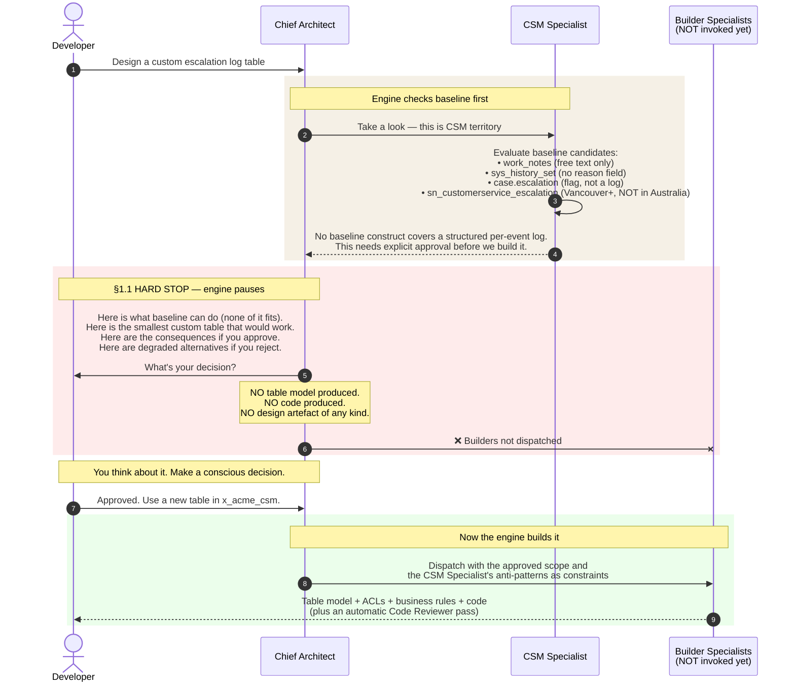
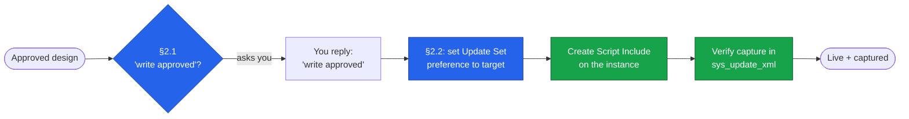

# User Guide and Examples

**Repository:** [`farstic/claude-servicenow-live`](https://github.com/farstic/claude-servicenow-live)
**Purpose:** The day-to-day operator's guide — four worked scenarios covering the most common ways the team uses the engine, including live deployment to a ServiceNow instance.
**Audience:** Whole team
**Last updated:** 29 May 2026
**Reading time:** 18 minutes

For each scenario: what you type, what the engine does, what you receive, and what to do next.

---

## How to send a prompt

Open Claude Code (`claude` from the repo root) and type your request at the `❯` prompt. If you prefer the browser, the same prompts work in the Master Project chat on Claude.ai — with one difference: **live deployment to an instance (Scenario 4) is CLI-only**, because the MCP connection runs through Claude Code. See [`INSTALLATION-GUIDE.md`](./INSTALLATION-GUIDE.md) or [`ADVANCED-WEB-SETUP.md`](./ADVANCED-WEB-SETUP.md) if you haven't set up yet.

There are no special commands or syntax. Describe what you need in plain English. Mention the module (ITSM, CSM, HRSD, ITOM) if it's obvious, mention "Australia release" so the engine doesn't recommend a feature you don't have, and let the engine handle the rest.

---

## Scenario 1 — Business Analyst: requirements to user stories

**Use this when:** you have stakeholder notes or workshop output and need sprint-ready user stories.

### What you type

```
We had a workshop yesterday with the IT Service Desk leads about incident
escalation. Here is what they want:

- L1 agents should be able to escalate an incident to L2 with a one-click
  action from the form, recording the escalation reason.
- The escalation must trigger an email to the L2 assignment group AND a
  Teams notification to the on-call engineer.
- Once escalated, the L1 agent retains read access but cannot reassign or
  close the incident.
- We need a weekly report of escalation volume by category and by L1 agent.

Module: ITSM. Workspace: Service Operations Workspace. Australia release.

Please produce sprint-ready Gherkin user stories with acceptance criteria
and propose any supporting stories I may have missed.
```

### What the engine does

The **ITSM Specialist** picks up the request first. It confirms the requirements map to baseline ServiceNow features — the existing escalation field, on-call rotation tables, the OOB notification framework, and `sys_history_set` for audit history. No custom build needed. The **Story Writer** then produces the deliverable.

### What you receive

A Gherkin Feature file containing:

- The **main scenario** — L1 escalates to L2 with reason, recipients get notifications.
- **Edge cases** — insufficient role, on-call engineer unavailable, Teams integration fails.
- **Proposed supporting stories** — access control, notification, audit, reporting, ATF test coverage, KBA documentation. (The stories you'd otherwise discover mid-sprint.)
- **Open questions** — e.g. *"Does the Teams notification need a new spoke, or is the existing Microsoft Teams spoke already deployed?"*

### What to do next

- Answer any open questions in your next message (or accept the defaults).
- Hand the Feature file to the sprint team, or continue with *"Please write the access control story as a separate Feature file."*

---

## Scenario 2 — Architect: integration design

**Use this when:** you need a full architectural specification for an integration with an external system.

### What you type

```
Design the integration that sends resolved P1 and P2 incidents from
ServiceNow to our Azure DevOps tenant. Each ServiceNow incident becomes
a work item in the Engineering project. The payload includes incident
number, short description, full description, resolution notes, resolved-by
user, and impacted CI.

Volume: approximately 100 P1/P2 resolves per day.
Authentication: OAuth2 against Azure DevOps.
Network: outbound traffic must go via the MID Server.
SLA: best effort, but failures must not be silent.

Module: ITSM. Australia release. Scoped app: x_acme_itsm.
```

### What the engine does

The **ITSM Specialist** confirms the integration trigger (resolved P1/P2 incidents) maps to baseline fields — no custom table needed on the source side.

The engine then proposes a **sequenced plan**:

1. **Integration Specialist** — designs the spoke architecture: REST Message definition, OAuth2 credential setup, retry logic (exponential backoff, 3 attempts), dead-letter handling, observability.
2. **Flow Designer Specialist** — designs the flow that triggers on incident resolution, filters for P1/P2, and calls the spoke.
3. **Developer** — implements any custom Action server script the flow needs.

Before the sequence starts, the engine flags **two consults** automatically: a Security & GRC review (outbound payload contains incident data) and a DevOps & Release Manager review (update set strategy for the spoke).

You approve the plan. The three specialists run in sequence, with the engine reviewing each output before moving on.

### What you receive

- Integration architecture specification (spoke, auth, retry, DLQ, logging)
- Flow Designer specification (trigger, filter, branches, error handling)
- Custom Action server code (if needed)
- An **automatic Code Reviewer pass** on any code produced
- Security & GRC consult notes, DevOps update set strategy notes

### What to do next

Review the Code Reviewer verdict. If it flagged anything as `FIX-BEFORE-PROD`, fold those into the next iteration. If anything is `BLOCK`, the engine offers to dispatch a rework cycle automatically — just say yes.

---

## Scenario 3 — Developer: the §1.1 halt in action

**Use this when:** you're about to ask the engine to build something custom and you want to see the governance discipline that makes the engine valuable.

### What you type

```
Design and implement an audit trail for case escalations on the customer
service case form. We need a separate structured log of every escalation
event with timestamp, escalated-by user, escalated-to group, and escalation
reason. Show me the table model and the Script Include. Australia release.
```

### What happens — and the visual

This request *looks* like it needs a custom table. The engine's job is to interrogate that assumption against baseline ServiceNow — now confirmed against the **live instance schema**, not just documentation — before writing a single field.



The key moment is the red zone. The engine **pauses**: no table model, no field list, no ACL matrix, no code. It surfaces the four baseline candidates it considered, names the smallest possible custom object it would propose, lists the consequences, and offers degraded alternatives. Then it waits.

### What you receive (before you've decided)

A pause. The message contains:

1. **The baseline candidates evaluated** — and exactly why each falls short.
2. **The custom object proposed** — at the smallest possible scope.
3. **Consequences of approval** — data model impact, deployment, support cost, upgrade risk.
4. **Alternatives if rejected** — degraded paths using baseline only.

What you will *not* see: a table name, field list, ACL matrix, code, or ERD. If you do see those in the same response as the OPEN QUESTION, the engine has bypassed §1.1 — that's a bug; please flag it. (This is regression-tested as **T-10**.)

### What to do next

Four legitimate responses:

| Reply | What happens |
|---|---|
| `"Approved. Use a new table in the existing x_acme_csm scoped app."` | The engine resumes and builds it with the approved scope as a constraint |
| `"Rejected — use the work_notes baseline alternative instead."` | The engine produces a baseline-only design with documented gaps |
| `"Re-evaluate option 2 more carefully — I think there's a baseline path."` | The CSM Specialist re-runs with the refined constraint |
| `"Defer this feature to the next release."` | The engine acknowledges and closes the thread |

The choice is yours, made consciously, documented in the thread.

---

## Scenario 4 — Deploying to a live instance (the two write gates)

**Use this when:** a design has been approved and reviewed, and you want the engine to build it *directly on your ServiceNow instance* rather than hand you code to paste. **CLI only** — this uses the MCP connection.

### What you type

```
The SLA breach-risk Script Include we designed is approved. Deploy it to
the instance. Put it in a new Update Set called "SLA Risk — May 2026".
Australia release.
```

### What the engine does — and what it asks you

The engine has already cleared §1.1 (the Script Include touches only baseline tables — `incident`, `task_sla`, `contract_sla`, `sys_user_group`). Before it writes anything, it runs the **two write gates** in order:



1. **Gate 1 — §2.1 Write Approval.** Even though you said "deploy it", the engine pauses and asks, verbatim: *"About to create the SLABreachRiskCalculator Script Include on the instance — write approved?"* Your original instruction is **not** sufficient on its own; the engine needs a discrete approval naming the write. You reply `write approved`.
2. **Gate 2 — §2.2 Update Set Capture.** The engine creates the "SLA Risk — May 2026" Update Set, points your `sys_update_set` user preference at it, *then* creates the Script Include — so ServiceNow captures it automatically.
3. **Verify.** The engine confirms the object appears in `sys_update_xml` for that Update Set.

### What you receive

- Confirmation the Script Include is live, with its name.
- Confirmation it was captured in the named Update Set (so it can be promoted).
- Any patch-after-create note that applied (for a Business Rule, that `action_insert`/`action_update` were set; see [`nowaikit-field-notes.md`](./nowaikit-field-notes.md)).

### What to do next

- Inspect the object in the instance, or ask the engine to query it back for you.
- When ready to promote, export the Update Set per your release process.
- The three artefacts already deployed this way are listed in [`LIVE-ARTEFACTS-CATALOGUE.md`](./LIVE-ARTEFACTS-CATALOGUE.md).

> **Why the friction is the point.** The engine will never write to your instance off the back of a general instruction. "Deploy it", "go ahead", or a tier upgrade are not write approvals. Each write is a discrete, named, logged decision — and every write lands in an Update Set, so nothing is ever stranded outside change control. Full detail: [`MCP-OPERATIONS-GUIDE.md`](./MCP-OPERATIONS-GUIDE.md).

---

## Tips for working with the engine

### Approving a proposal (design)

The engine always proposes before it builds. Design approvals are simple: `Yes, proceed.` · `Approved — go.` · `Continue with the plan as stated.`

### Approving a write (deployment)

A **live write** needs an explicit, specific approval — `write approved` — naming what's being written. A design approval does not carry over to a deployment. This is deliberate (§2.1).

### Redirecting

When the proposed plan is wrong, push back specifically: `No — route this to the Integration Specialist first.` · `Skip the Performance & Scale consult; volumes are small.` · `Re-route to Story Writer; I want Gherkin, not a technical design.`

### Declining the automatic Code Reviewer pass

The Code Reviewer fires automatically on any JavaScript. You can decline — `Skip the Code Reviewer pass — this is a throwaway prototype.` — but keep it on for anything destined for an instance.

### `Status` is your orientation command

Type `Status` any time to see the loaded engagement, the locked release family, the full specialist roster, and any drift the engine has noticed. Useful at session start or after a long pause.

### Switching engagements

`Switch context to clients/<client-name>/.` The engine reads that engagement's instructions and applies its defaults silently from then on.

---

## Where to next

- For the team metaphor and value proposition: [`BUSINESS-OVERVIEW.md`](./BUSINESS-OVERVIEW.md).
- For the protocol mechanics: [`TECHNICAL-ARCHITECTURE.md`](./TECHNICAL-ARCHITECTURE.md).
- For live-instance operations: [`MCP-OPERATIONS-GUIDE.md`](./MCP-OPERATIONS-GUIDE.md).
- For setup: [`INSTALLATION-GUIDE.md`](./INSTALLATION-GUIDE.md) · browser: [`ADVANCED-WEB-SETUP.md`](./ADVANCED-WEB-SETUP.md).

---

*Documents the [Claude ServiceNow Architecture Engine](https://github.com/farstic/claude-servicenow-live) v2.6 for day-to-day operators.*
