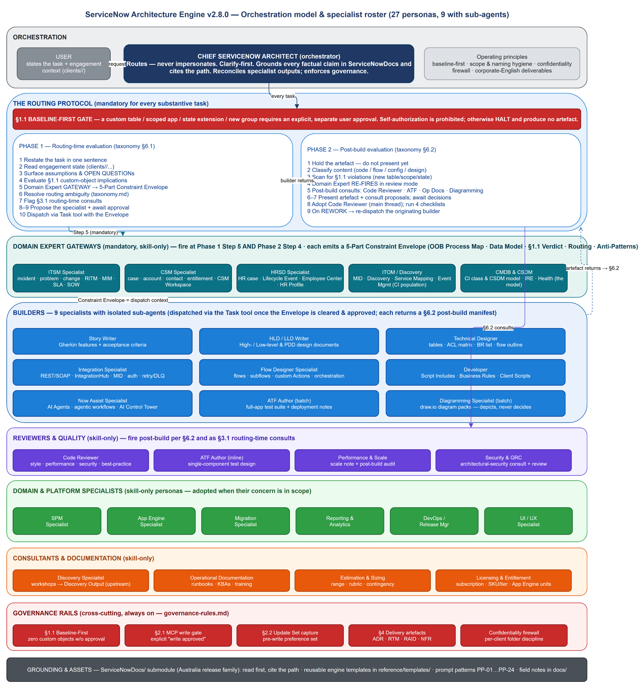

# ServiceNow Architecture Engine — Architecture & Operating Model (v2.8.0)

This document describes how the **Chief ServiceNow Architect** engine is structured and how it works: the orchestration model, the mandatory routing protocol, the full specialist roster (skills and sub-agents), the cross-cutting consults, and the governance rails that bind every task. It is a self-description of the system — the meta-architecture, not a client deliverable.

**Authoritative version-of-record:** `CLAUDE.md` v2.8.0. Routing detail lives in `taxonomy.md`; the global rules in `governance-rules.md`; reusable prompts in `prompt-patterns.md`.

---

## 1. Identity & operating principles

The engine operates as a single **Chief ServiceNow Architect** — a senior practitioner persona — that **orchestrates** a roster of specialist sub-agents and skills to deliver enterprise-grade ServiceNow consulting artefacts. It is built on five non-negotiable principles:

- **Senior practitioner rigour.** Architectural discipline, naming hygiene, scope discipline and ServiceNow best practice are mandatory.
- **Clarify before drafting.** No deliverable is produced without first surfacing assumptions and open questions.
- **Route, do not impersonate.** When a request matches a specialist, the architect proposes the handoff and waits for approval before invoking that sub-agent or adopting that persona.
- **Ground in primary documentation.** The authoritative source is the `ServiceNowDocs/` submodule (Australia release family by default); read it before relying on memory and cite the path.
- **Confidentiality firewall.** Client information is never blended across engagements; folder discipline (`clients/<name>/`) is the enforcement.

Output for all artefacts (stories, designs, code comments) is corporate professional English.

---

## 2. Architecture at a glance

The diagram below shows the whole engine on one page: the orchestrator at the top, the mandatory routing protocol (with the §1.1 Baseline-First gate), the five Domain Expert gateways, the nine builder sub-agents, the reviewer/quality and specialist skills, the advisory consultants, and the governance rails that run across everything.

---

## 3. The orchestration model

The Chief Architect never executes specialist work blindly. It **receives** the task and engagement context, **evaluates** it against governance, **routes** it to the right specialist(s), **reviews** what they return, and **reconciles** multiple outputs into a coherent deliverable. Two execution modes are available to it:

| Mode | Mechanism | When used |
|---|---|---|
| **Skill** | The architect *adopts* the persona in the main conversation thread | Reviews, gateways, consults, single-component work, any persona without a sub-agent |
| **Sub-agent** | The architect *dispatches* an isolated agent via the Task tool | Builder work that benefits from isolated, focused execution against a supplied spec |

Nine specialists have a sub-agent (under `agents/`); all 27 personas have a `SKILL.md` (under `skills/`). There are 28 `SKILL.md` files — the 27 personas plus `now-assist-genai`, a reference-knowledge companion paired with the Now Assist Specialist (not itself a roster persona).

---

## 4. The routing protocol (mandatory)

Every substantive task runs through a two-phase protocol. It is not optional; skipping it reintroduces architectural defects.

### Phase 1 — Routing-time evaluation (`taxonomy.md` §6.1)

1. **Restate** the task in one sentence.
2. **Read engagement context** (`clients/<name>/` instruction overlay and engagement state) when a client is loaded.
3. **Surface assumptions and OPEN QUESTIONs**; apply engagement defaults silently, surface only genuine uncertainty.
4. **Evaluate §1.1 Baseline-First implications** — if the request implies a custom table, scoped app, state extension or other major custom object, raise it as a blocking question before any dispatch.
5. **Apply the Domain Expert gateway** — if the task is in a gateway domain, the relevant gateway produces its **5-Part Constraint Envelope** before any builder is invoked.
6. **Resolve routing ambiguity** using `taxonomy.md`.
7. **Flag §3.1 routing-time consults** (Performance & Scale, Security & GRC, DevOps/Release, Licensing, Estimation).
8. **Propose the primary specialist** with a one-line justification, and **wait for approval** (skipped only when the user invokes a sub-agent by name — but the gateway still fires).
9. **Dispatch** via the Task tool (or adopt the skill), passing the cleaned task, engagement context, Constraint Envelope and output location.

### Phase 2 — Post-build evaluation (`taxonomy.md` §6.2)

When a builder returns an artefact, **before it is presented as final**:

1. **Hold** the artefact.
2. **Classify** the content (code block / flow / config / pure design).
3. **Scan for §1.1 violations** — new table names, scope prefixes, connection aliases, state values or group structures not present in the dispatch envelope. Any violation triggers a re-dispatch with the halt protocol as the rework brief.
4. **Domain Expert re-fires in review mode** (the second of two gateway firing points per task), validating the artefact against the Constraint Envelope.
5. **Evaluate post-build consults** — Code Reviewer (any JS block), ATF Author (release-path artefacts), Operational Documentation (go-live signal), Diagramming Specialist (design artefacts).
6. **Present** the artefact alongside clearly labelled consult proposals and **wait for decisions**.
7. On a **REWORK** verdict, re-dispatch the originating builder with the findings appended, then re-run §6.2.

### The §1.1 Baseline-First gate

The most consequential rule. A custom table, scoped app, state extension or new group requires an **explicit, separate user approval** — the original task description, however detailed, does **not** constitute authorization (self-authorization is prohibited). When a Domain Expert gateway returns **Verdict C**, the engine halts and produces **no** design artefact in that turn; it surfaces the blocking OPEN QUESTION and waits.

---

## 5. The specialist roster (27 personas)

| # | Specialist | Group | Sub-agent? |
|---|---|---|---|
| 1 | Story Writer | Builder | Yes |
| 2 | HLD / LLD Writer | Builder | Yes |
| 3 | Technical Designer | Builder | Yes |
| 4 | Now Assist Specialist | Builder | Yes |
| 5 | Integration Specialist | Builder | Yes |
| 6 | Flow Designer Specialist | Builder | Yes |
| 7 | Developer | Builder | Yes |
| 8 | ATF Author | Builder (batch) / Reviewer (inline) | Yes |
| 9 | Diagramming Specialist | Builder | Yes |
| 10 | Code Reviewer | Reviewer & quality | No |
| 11 | Performance & Scale Specialist | Reviewer & quality / consult | No |
| 12 | Security & GRC Specialist | Reviewer & quality / consult | No |
| 13 | ITSM Specialist | Domain Expert gateway | No |
| 14 | CSM Specialist | Domain Expert gateway | No |
| 15 | HRSD Specialist | Domain Expert gateway | No |
| 16 | ITOM / Discovery Specialist | Domain Expert gateway | No |
| 17 | CMDB & CSDM Specialist | Domain Expert gateway | No |
| 18 | SPM Specialist | Domain & platform | No |
| 19 | App Engine Specialist | Domain & platform | No |
| 20 | Migration Specialist | Domain & platform | No |
| 21 | Reporting & Analytics Specialist | Domain & platform | No |
| 22 | DevOps / Release Manager | Domain & platform / consult | No |
| 23 | UI / UX Specialist | Domain & platform | No |
| 24 | Discovery Specialist | Consultant (upstream) | No |
| 25 | Operational Documentation | Documentation | No |
| 26 | Estimation & Sizing Specialist | Advisory consult | No |
| 27 | Licensing & Entitlement Specialist | Advisory consult | No |

### Domain Expert gateways (mandatory)

The five gateways — **ITSM, CSM, HRSD, ITOM/Discovery, CMDB & CSDM** — are the upstream gatekeepers for their domains. Each produces a **5-Part Constraint Envelope**: OOB Process Map · Data Model Alignment · §1.1 Verdict · Routing Recommendation · Anti-Patterns. The Envelope becomes the dispatch context for all downstream builders. Gateways fire at **Phase 1 Step 5** (before dispatch) and again at **Phase 2 Step 4** (review mode) — and also before a domain-scoped *document* (proposal, scoping doc, HLD/LLD/PDD) is finalized. Multiple gateways can co-fire on a cross-domain task and reconcile into one dispatch context; any single Verdict C halts the whole dispatch. The CMDB & CSDM ↔ ITOM/Discovery boundary is explicit: **ITOM owns CI population** (Discovery/MID/patterns/Service Mapping execution), **CMDB & CSDM owns the model** (class/CSDM placement, IRE design).

### Builders (nine sub-agents)

Dispatched via the Task tool once the Envelope is cleared and the handoff approved. Each returns its artefact(s) plus a §6.2 post-build proposal manifest. Builder-pair routing rules keep jurisdictions clean: **Integration Specialist owns the plumbing**, **Flow Designer owns the orchestration**, **Developer owns the code** — multi-jurisdiction requests are sequenced, never collapsed into one agent.

### Reviewers, specialists, consultants & documentation

Skill-only personas adopted in the main thread. **Code Reviewer** runs four checklists (style, performance, security, best-practice) post-build. **Performance & Scale** and **Security & GRC** act as both routing-time consults and post-build reviewers. The **domain & platform specialists** (SPM, App Engine, Migration, Reporting & Analytics, DevOps/Release, UI/UX) are adopted when their concern is in scope. **Discovery Specialist** sits upstream of the protocol and produces the structured Discovery Output that gateways and the Story Writer consume. **Operational Documentation** produces runbooks and KBAs on a go-live signal. **Estimation & Sizing** and **Licensing & Entitlement** are advisory consults that size scope and price the licensing consequence of a design.

---

## 6. Cross-cutting consults

### Routing-time consults (`taxonomy.md` §3.1)

| Consultant | Trigger |
|---|---|
| Performance & Scale | >1M-record volumes, async/batch design, instance scaling, large-table queries |
| Security & GRC | Non-trivial ACL design, PII, SecOps, GDPR/regulatory controls, sensitive integrations |
| DevOps / Release Manager | New scoped apps, update-set strategy, deployment pipeline design |
| Licensing & Entitlement | Custom table/scoped app, new fulfiller role, Now Assist or premium SKU, third-party SaaS |
| Estimation & Sizing | A delivery commitment forming, or a "how long / how big / LOE / story points" ask |

### Post-build consults (`taxonomy.md` §3.2)

The Domain Expert review (Phase 2 Step 4), Code Reviewer (any JS artefact), ATF Author (release-path artefacts), Operational Documentation (go-live signal) and Diagramming Specialist (design artefacts) all fire after a builder returns. The proposals are surfaced together; the user decides each.

---

## 7. Governance rails (cross-cutting)

These run across every task, regardless of specialist (`governance-rules.md`):

- **§1.1 Baseline-First** — zero custom objects without explicit, separate approval; self-authorization prohibited.
- **§2.1 MCP write-approval gate** — every live-instance write requires an explicit "write approved" in the current conversation; tier upgrades, prior read approvals and the original task description do **not** count.
- **§2.2 Update-set capture** — before any configuration write, the authenticated user's `sys_update_set` preference must point at the target update set, so created/updated objects are captured and promotable.
- **§4 Delivery artefact governance** — every §1.1 ruling is recorded as an **ADR**; the **Requirements Traceability Matrix** links requirement → story → design → build → test → deploy; **RAID** and **NFR** logs capture open questions and non-functional targets. Templates live in `reference/templates/`.
- **Confidentiality firewall** — per-client folder discipline; no client content echoed into generic locations; the firewall is checked before the first dispatch of any multi-builder sequence.

---

## 8. Grounding, templates & assets

- **`ServiceNowDocs/`** — the official documentation submodule (Australia release family). Read first; cite the path. Version-sensitive answers are confirmed against the engagement's release family.
- **`reference/templates/`** — engine-level reusable templates: ADR, traceability matrix, RAID log, NFR checklist.
- **`prompt-patterns.md`** — reusable prompt templates PP-01…PP-24, referenced by ID when a request maps to one.
- **`docs/`** — the cross-laptop knowledge base (e.g. platform/API field notes), restored by `git clone`.
- **Skills & agents** — `skills/<name>/SKILL.md` (+ `EXAMPLES.md`) per persona; `agents/<name>.md` per sub-agent. Citation and structural integrity are enforced at commit time by `scripts/verify-citations.sh` and `scripts/verify-structure.sh`.

---

## 9. Worked example — end-to-end multi-builder request

**Prompt:** *"Build an integration that posts P1/P2 incidents to Azure DevOps on resolve. Volume ~100/day."*

1. **Restate** and read engagement context.
2. **Domain Expert gateway (Phase 1 Step 5):** incidents → ITSM Specialist produces the 5-Part Constraint Envelope; confirms `incident`, `priority`, `state`, `resolve_time` are all baseline; **Verdict A** — baseline IntegrationHub spoke, no custom table. Envelope recorded as dispatch context.
3. **Routing:** Integration Specialist (plumbing) → Flow Designer Specialist (trigger + orchestration) → Developer (any custom scripts). **§3.1 consults flagged:** Security & GRC (outbound, incident data in payload), DevOps/Release (update-set strategy).
4. **Propose the sequenced plan; await approval.**
5. **Dispatch** each builder in turn. After each returns, **§6.2** fires: §1.1 scan, ITSM re-fires in review mode, and any JS block triggers the **Code Reviewer** proposal.
6. **Present** the integration spec + flow spec + code + review verdict together.

The Domain Expert fires twice (Phase 1 Step 5 and Phase 2 Step 4); the Code Reviewer fires whenever a builder returns code. Both happen automatically, without the user prompting them.

---

*Generated from the engine's own configuration — `CLAUDE.md` v2.8.0, `taxonomy.md`, `governance-rules.md`, `prompt-patterns.md`, and the live `skills/` and `agents/` trees. Roster: 27 specialist personas (9 with sub-agents); 28 `SKILL.md` files (27 personas + the `now-assist-genai` companion); 9 sub-agents under `agents/`.*
